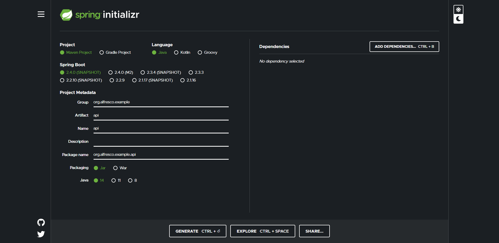

# Api- Application

APIs are a great way of communicating with ACS from the outside and are thus perfect for custom applications.


## What to expect

In this tutorial, you will build such an application class by class and learn how they work together and utilize the Alfresco APIs.

This includes the following most essential features of ACS:

- Setting Authorization credentials
- Getting basic information on a node

More features will follow in additional entries of this series.


## Prerequisites

Our [Contract Management](https://www.alfresco.com/abn/tutorials/contract-management/) series is vital for this tutorial as the demo application relies on sites,folder structures and content models created in these guides, so please make sure to check them out.

If you want to skip the series and only create the site and folders needed for this guide just complete these sections:

- [Create a content model](https://www.alfresco.com/abn/tutorials/contract-management/content-model/#creating-your-first-content-model)
- [Create site and folder structure (not yet linked)]()

We recommend going through our [API- Tutorial (not yet linked)]() series, as it will show you the basic functions of ACS and how to leverage them using APIs.
Also, they illustrate how to call an API and what a request should look like.

Let’s setup a basic Spring Boot application which will serve as the foundation for our application. Go to https://start.spring.io/ and replicate the following screenshot, then hit “Generate”.



After you’ve done so, extract the folder you just downloaded and move it to a location of your choosing.  
Now open your IDE (we recommend [Visual Studio Code](https://code.visualstudio.com/)) and click *File* -> *Open Folder* and select the folder you moved.


*Note: This gif merely illustrates the basic steps you have to take. We do not recommend storing your application in your Downloads folder.*

Now you will have the basic project structure, but with only part of the resources and dependencies, you need.

Before we come to those, though, let’s rename the `ApiApplictaion` class to `Controller` by right-clicking on the class name inside the class and hit *Rename Symbol* or simply mark it and press F2. 

Now let `Controller` implement the `ApplicationRunner` interface and remove the content of the `main()` method to replace it later on with our code.


Next, copy the following dependency into your pom file:

```
<dependency>
    <groupId>org.json</groupId>
    <artifactId>json</artifactId>
     <version>20090211</version>
</dependency>
```

JSON will provide you with the ability to create JSONObjects, which we will use as a representation of ACS nodes within our application.

Now that all is set up, let’s talk about how we will go about building this app.


## What’s the plan here?

At the end of this guide you will have an application that returns basic information on any specified node within your site.  
In later tutorials more features will be added like creating a node or renaming one.

The way we will proceed is building this application from the inside out, meaning we will start with the most “low level” classes without any dependencies to other ones.

That means `Authorization`, which will be used to enable the application to log into ACS.

Next, you will build the core of the application, which are the API requests.  
These are all methods of the same class and will be called by the various operations of your application (in this guide, it will only be the `Get` operation).

On top of that you will build said operation classes. Those will assemble the parameter needed for the specific operation they’re designed for and pass them down to one of the requests.

Next up is the `Logic` class, which is the only class to have access to `Authorization`, so its main task is to establish a specific workflow and give other classes the “go-ahead” by providing authorization.

Lastly, we will go through the `Controller` class with the `main()` method.  
It serves as the interface between user and application, taking the commands and passing them down to the `Logic` class.

*Sidenote: The `APIsInterface` is a collection of API parts that will be used as a shortcut for assembling the suffixes passed on to the request methods (more on that later).  
As this interface isn’t crucial to the functionality of this application, it is not listed above, but it is a nice-to-have. You can get it below.*

```
package org.alfresco.example.api;

public interface APIs {
    public static final String base = "http://localhost:8080/alfresco/api/-default-/public/alfresco/versions/1";

    public static final String nodes = "/nodes";
    public static final String people = "/people";
    public static final String sites = "/sites";
    public static final String root = "/-root-";

    public static final String relativePathToSite = "?relativePath=%2FSites%2Fmyinc%2FdocumentLibrary";

    public static final String content = "/content";
    public static final String comments = "/comments";
    public static final String children = "/children";
    public static final String lock = "/lock";
    public static final String unlock = "/unlock";
    public static final String action = "/action-executions";
}
```


You can get the finished application [here (not yet linked)]() or build it piece by piece as you read through this guide.  
Every chapter will begin with the imports of the respective class for you to copy into your IDE.  
The classes you’ll have to create before getting into a new chapter should be named after the title as they are referenced in the import statements later.


## Authorization

```
import java.util.Base64;
```

The first class we will cover, as announced in the chapter above is `Authorization`.  
It is a class without any dependencies to other classes in this application. It contains the credentials you use to log in, which are here admin/admin by default, as determined by the constructor of the class.

Another attribute it holds is `basicAuth`, which is an encoded String containing the username and password you are currently using and is used by the requests to authenticate their call.

```
private String acsUser;
private String acsPassword;

private String basicAuth;


//sets default credentials to admin/admin
public Authorization(){

     this.acsUser = "admin";
    this.acsPassword = "admin";

    this.basicAuth = this.buildBasicAuth();
}
```

There are a total of two methods here: The first being `buildBasicAuth()`, which takes both `acsUser` and `acsPassword`, and encodes them to use later on.  
The second is `changeAuth()`, and it - surprise - changes the Authentication attributes. It does so by taking two Strings, assigning them to `acsUser` and `acsPassword`, then calling `buildBasicAuth()`.

```
//sets new credentials
public void changeAuth(String acsUser, String acsPassword){
    this.acsUser = acsUser;
    this.acsPassword = acsPassword;

    this.basicAuth = this.buildBasicAuth();
}


//builds authorization
private String buildBasicAuth(){
    return "Basic " + Base64.getEncoder().encodeToString((this.acsUser + ":" + this.acsPassword).getBytes());
}

public String getAcsUser(){ return acsUser; }

public String getAcsPassword(){ return acsPassword; }

public String getBasicAuth() { return basicAuth; }
```


## Requests

```
import java.io.IOException;
import java.net.URI;
import java.net.http.HttpClient;
import java.net.http.HttpRequest;
import java.net.http.HttpResponse;

import org.json.JSONException;
import org.json.JSONObject;
```

The Requests class stores all basic API requests like `get()`, `post()`, `put()` and `delete()`. This guide will only utilize the `get()` method, however.

The first method, `setRoot()`, is a bit of a necessary evil, as it isn’t one of the four request methods, but we still need it because we need to establish a starting point for the application to look for nodes, in other words: It’s setting the root.  
It does so by first setting up a client, which will later be responsible for sending your request.   
The next step is to build your actual request. This happens in three steps:

- `uri(URI.create())` determines which API is called
- `setHeader()` inserts the `Authorization` built in the last class you wrote
- And finally, `build()` takes those two components and assembles a request body

The API you call in this method is hardcoded to return all children of the *Document Library* of the site called *MyInc* you created in the [Contract Management](https://www.alfresco.com/abn/tutorials/contract-management/) series.  
The purpose of the `try catch()` statement is to check whether the credentials you are currently using are valid.  
A JSONException is only thrown if the property specified, in our case `list`, can’t be found within the response body.  
So if we assume that the *MyInc* site and the *Contracts folder* within it are given, the only way for the method to throw a JSONException is because it can’t log in due to incorrect credentials.  
We will make use of that circumstance later on. 

Next, we will have our client send the request you just built and save the response to turn its body into a JSONObject.  
*Note: It is important to take the body of the response as the response itself only consists of a status code and summary, for example “200 ok”. The body is the part containing the nodes we asked for.*

The return statement will then drill down to the first entry, which we will assume is the *Contracts* folder.

```
//sets the root directory for Get to your Site (hard coded)
public JSONObject setRoot(Authorization authorization) throws JSONException, IOException, InterruptedException {

    //builds request
    HttpClient client = HttpClient.newHttpClient();
    HttpRequest request = HttpRequest.newBuilder()
            .uri(URI.create(APIs.base + APIs.nodes + APIs.root + APIs.children + APIs.relativePathToSite))
            .setHeader("Authorization", authorization.getBasicAuth())
            .build();

    HttpResponse<String> response = client.send(request,
            HttpResponse.BodyHandlers.ofString());

    //converts response into JSONOboject
    JSONObject body = new JSONObject(response.body());

    //drills down to the first node in your Document Library (should be "Contracts")
    try {
        return body.getJSONObject("list").getJSONArray("entries").getJSONObject(0).getJSONObject("entry");
    }
    catch (JSONException e){
        return null;
    }
}
```

Now we’re getting to the four request classes, which are all following the same basic principle as the last with the notable difference that the API they are calling isn’t hardcoded.  
It is determined by the `suffix` parameter the calling operation is passing along.

Also, `post()` and `put()` need to specify the kind of request they want to execute and add a request body to their request, provided by the operation.  
*Delete()* also needs to state it’s a request type, but without any request body, because it only requires the `nodeId` to work which is contained in the `suffix`.

```
//suffix dictates which API is called and is determined by the calling operation
//basic API requests follow
public HttpResponse<String> get(String suffix, Authorization authorization) throws IOException, InterruptedException, JSONException {

    HttpClient client = HttpClient.newHttpClient();
    HttpRequest request = HttpRequest.newBuilder()
            .uri(URI.create(APIs.base + suffix))
            .setHeader("Authorization", authorization.getBasicAuth())
            .build();

    HttpResponse<String> response = client.send(request,
            HttpResponse.BodyHandlers.ofString());

    return response;
}


public HttpResponse<String> post(String suffix, String requestBody, Authorization authorization) throws IOException, InterruptedException, JSONException {

    HttpClient client = HttpClient.newHttpClient();
    HttpRequest request = HttpRequest.newBuilder()
            .uri(URI.create(APIs.base + suffix))
            .setHeader("Authorization", authorization.getBasicAuth())
            .POST(HttpRequest.BodyPublishers.ofString(requestBody))
            .build();

    return client.send(request,
            HttpResponse.BodyHandlers.ofString());
}


public HttpResponse<String> put(String suffix, String requestBody, Authorization authorization) throws InterruptedException, IOException, JSONException {

    HttpClient client = HttpClient.newHttpClient();

    HttpRequest request = HttpRequest.newBuilder()
            .uri(URI.create(APIs.base + suffix))
            .setHeader("Authorization", authorization.getBasicAuth())
            .PUT(HttpRequest.BodyPublishers.ofString(requestBody))
            .build();

    return client.send(request,
            HttpResponse.BodyHandlers.ofString());
}


public HttpResponse<String > delete(String suffix, Authorization authorization) throws IOException, InterruptedException {

    HttpClient client = HttpClient.newHttpClient();

    HttpRequest request = HttpRequest.newBuilder()
            .uri(URI.create(APIs.base + suffix))
            .setHeader("Authorization", authorization.getBasicAuth())
            .DELETE()
            .build();

    return client.send(request,
             HttpResponse.BodyHandlers.ofString());
}
```

The last difference is that these methods will simply return the HttpResponse without turning it into a JSONObject first. This is because the outcome of `setRoot()` is binary: either we get a node to work with or no node at all, which means our credentials are off.  
But with the request methods, the errors can be a little more diverse: Maybe a node wasn’t found or there is an internal error. That’s why these methods return the `briefSummary` property in case an error is returned.

Below you can see a sample error response.  
Every error response will have these properties.

```
{
    "error": {
        "errorKey": "framework.exception.EntityNotFound",
        "statusCode": 404,
        "briefSummary": "08070001 The entity with id: 02e485bf-2662-4ffb-b449-989af2eab550 was not found",
        "stackTrace": "For security reasons the stack trace is no longer displayed, but the property is kept for previous versions",
        "descriptionURL": "https://api-explorer.alfresco.com"
    }
}
```


## OperationsInterface

*Note: Create a new folder called “operations” within “api” and move the class there.
Also change its type from class to interface.*

```
import java.io.IOException;

import org.alfresco.example.api.Authorization;
import org.json.JSONException;
import org.json.JSONObject;
```

Now that you have your basic API requests in place, let’s create a class to put those requests to use.  
First of all we need an interface which every operation class can implement, that way the `Logic` class isn’t dependent on the type of operation you want to execute which makes it a lot more versatile.

To build this interface, we first need to think about how to unify all the different operation classes to implement it.  
We do this by determining that every operation needs a `targetNode` or a `resultNode` and two String parameters max (these will be pointed out individually as we go through the operation classes).  
In addition to those parameters, we will also have an attribute called an `answer`, which serves as feedback for the user on whether the operation was successful or not.  
Besides the getters and setters for these attributes, an operation class also needs an `execute()` method that will run the required request using its instance attributes.

```
public void setTargetNode(JSONObject targetNode);

public JSONObject getTargetNode();

public void setResultNode(JSONObject resultNode);

public JSONObject getResultNode();

public void setParam1(String param1);

public String getParam1();

public void setParam2(String param2);

public String getParam2();

public void setAnswer(String answer);

public String getAnswer();

public void execute(Authorization authorization) throws IOException, JSONException, InterruptedException;
```


## Get

*Note: Put Get into the “operations” folder and let it implement OperationInterface!*

```
import java.io.IOException;
import java.util.ArrayList;
import java.util.List;
import java.util.Scanner;

import org.alfresco.example.api.APIs;
import org.alfresco.example.api.Authorization;
import org.alfresco.example.api.Requests;
import org.json.JSONArray;
import org.json.JSONException;
import org.json.JSONObject;
```

A feature we will need for almost every other operation is `Get`, which will return a node from ACS node based on the `searchTerm` parameter.

Get implements 3 of 5 parameters of `OperatioInterface`:
- `resultNode`, which is then returned node from ACS
- `searchTerm`, set by the Controller
- `answer`, used to articulate response for the user

It has two attributes unique to its class, namely `queryList` and `relativeRoot`, we will get to those in just a bit.

First, there is an attribute in every feature class, which doesn’t need to be set or got from the outside, so it is not included in the `OperationInterface`: `requests`.  
It provides the request methods for this class.

```
private JSONObject resultNode;

private String searchTerm;

private String answer;

private List<JSONObject> queryList;
private JSONObject relativeRoot;

private Requests requests;
```

Now let’s take a look at the constructor, which is pretty basic: It sets up all the parameters the `execute()` method will need later on.  
One thing worth mentioning though, is the `relativeRoot` attribute. As we learned in the *Requests* chapter, our application needs a place to start looking.  
This starting point is determined here by the parameter `root` passed down by the `Logic` class.   
The fact that the attribute of `Get` is called `relativeRoot` rather than just root will come into play in the next method.

```
public Get(String searchTerm, JSONObject root) throws InterruptedException, IOException, JSONException {
    this.searchTerm = searchTerm;

    this.requests = new Requests();

    this.relativeRoot = root;
    this.queryList = new ArrayList<>();
}
```

This one is named `assambleQueryList()` and serves as a supporting method for `execute()`. It will create a JSONArray out of every node within the relativeRoot, which is, as of now the Contracts folder of your site.  
As you also created four more folders inside *Contracts* (*New*, *Review*, *Approved*, *Smart Folder*) we will assume that the method won’t stop working there due to an empty array but continue by iterating over it in the `for()` loop.

After assigning two new variables, `entry` and `entryName`, the method checks if the `entryName` contains the `searchTerm` and adds the `entry` to the `queryList`.  
The `queryList` is an `ArrayList` that will contain every node matching the `searchTerm`.
So far, so easy.

Now if our `entry` is a folder, that means we have to go one level deeper into the structure of your site. This is where the “relative” part of `relativeRoot` becomes interesting because we will now set our `entry` as `relativeRoot` and let the method call itself so that it now assembles a JSONArray of every child within that folder.  
*Node: As Smart Folders are only a collection of nodes, which already exist somewhere else on the system, it would create duplicates in the `queryList`, so we need to exclude the one you created within the Contracts folder.*

```
private void assambleQueryList(Authorization authorization) throws JSONException, IOException, InterruptedException {

    //gets every node inside relativeRoot
     JSONArray entries = new JSONObject(requests.get(APIs.nodes + "/" + relativeRoot.getString("id") + APIs.children,
            authorization).body())
            .getJSONObject("list").getJSONArray("entries");

    //interrupts if array is empty
    if (entries.length() == 0) {
        return;
    }

    //searches every node inside the array for param
    for (int i = 0; i < entries.length(); i++) {

        JSONObject entry = entries.getJSONObject(i).getJSONObject("entry");

        String entryName = entry.getString("name");

        //if match is found gets added to querylist
        if (entryName.contains(this.searchTerm)) {
            this.queryList.add(entry);
        }

        //if node is folder method calls itself with relativeRoot set to this node
        if (entry.getBoolean("isFolder") && !entry.getString("name").equals("Smart Folder")) {
            this.relativeRoot = entry;

            this.assambleQueryList(authorization);
        }
    }
}
```

Now we’re getting to the heart of this class: the `execution()` method.  
First of it assigns the `queryList` to a new variable called `list`, just for brevity.

Then it checks whether there is a `list` to work with at all. If not, it sets the `answer` of the `Get` instance to “*Node not found!*” and returns.

But should the `list` not be empty, it will initiate a variable called `choice` and set it to 0, so that if the `assambleQueryList()` method only found one node, it will get picked after the `if()` statement right away.

Should there be multiple hits in the `list` the method will print a response in the form of:

	Choose desired node:
	0: [entryName] ([parentNodeName])
	1: [entryName] ([parentNodeName])
	2: [entryName] ([parentNodeName])

`Get` is the only class apart from the Controller, the user can actively interact with, as it needs clarification which node to pick.  
The `Scanner` takes the user’s input and assigns it to the `choice` variable.  
Next, the method will check if the input is valid and if not, it will keep asking until it is.

Lastly, the method will assign the chosen node to the `resultNode` attribute and set a formatted version as the answer.

```
@Override
public void execute(Authorization authorization) throws IOException, JSONException, InterruptedException {
    this.assambleQueryList(authorization);

    List<JSONObject> list = this.queryList;

    if (list.isEmpty()) {
        this.answer = "Node not found!";

        return;
    }

    int choice = 0;

    //if only one node is returned it gets chosen without asking the user
    if (list.size() > 1) {
         Scanner scanner = new Scanner(System.in);

        System.out.println("Choose the desired node:");
        //lists every node in the queryList for the user
        for (int i = 0; i < list.size(); i++) {

            String parentNodeName = new JSONObject(requests.get(APIs.nodes
                    + list.get(i).getString("parentId"), authorization).body())
                    .getJSONObject("entry").getString("name");

            System.out.println(i + ": " + list.get(i).getString("name") + " (" + parentNodeName + ")");
        }

        choice = scanner.nextInt();

        while (choice >= list.size()) {
            System.out.println("Invalid input!");

            choice = scanner.nextInt();
        }
    }

    this.resultNode = list.get(choice);

    //formats JSONObject
    this.answer = this.resultNode.toString(4);
}
```

What follows are all the getters and setters that need to be implemented.

```
@Override
public void setTargetNode(JSONObject resultNode) { }

@Override
public JSONObject getTargetNode() {
    return null;
}

@Override
public void setResultNode(JSONObject resultNode) {
    this.resultNode = resultNode;
}

@Override
public JSONObject getResultNode(){ return this.resultNode; }

@Override
public void setParam1(String searchTerm) {
    this.searchTerm = searchTerm;
}

@Override
public String getParam1() {
    return null;
}

@Override
public void setParam2(String param2) { }

@Override
public String getParam2() {
    return null;
}

@Override
public void setAnswer(String answer) {
    this.answer = answer;
}

@Override
public String getAnswer() {
    return this.answer;
}
```


## Logic

*Note: The following classes will be created outside the “operations” folder!*

```
import java.io.IOException;

import org.alfresco.example.api.operations.Get;
import org.alfresco.example.api.operations.OperationInterface;
import org.json.JSONException;
import org.json.JSONObject;
```

Next up we have the `Logic` portion of the application, which is responsible for mediating between the `Controller` and the operation classes.

It is the only class with direct access to the `Authorization` instance and gives the other classes access to it by passing it along in a method call.  
Also, it contains an attribute called root, which it passes down to the Get class, to give it a starting point.  
Lastly, `Logic` also has access to a `request` instance of its own so it can set `root` in the constructor.

```
private Authorization authorization;
    
private JSONObject root;

private Requests requests;


//Logic is the only class with access to Authorization, so every action has to go through it first
public Logic() throws InterruptedException, IOException, JSONException {
    this.authorization = new Authorization();
    this.requests = new Requests();

    this.root = requests.setRoot(this.authorization);
}
```

`Logic` consists of three different methods:  

The first one is the `changeAuthorization()` method, which initiates two new Strings and sets them to the current credentials in case the app is unable to log into ACS with the new ones.  
Now we are making use of the fact that the `setRoot()` method only returns null if our credentials are incorrect by calling it with the updated `Authorization` instance.  
Should the attempt fail, it reverts `Authorization` to the old credentials and resets the `root`. It goes on by returning a String informing the user that his/her entered credentials were invalid and logged back in with the previous account.  
If `setRoot()` returns a node, the method returns a success String.

```
//case in point - the Controller can't call Authorization directly
public String changeAuthorization(String acsUser, String acsPassword) throws InterruptedException, IOException, JSONException {
    String oldAcsUser = authorization.getAcsUser();
    String oldAcsPassword = authorization.getAcsPassword();

    this.authorization.changeAuth(acsUser, acsPassword);

    this.root = this.requests.setRoot(this.authorization);

    if (this.root == null){
        this.authorization.changeAuth(oldAcsUser, oldAcsPassword);

        this.root = this.requests.setRoot(this.authorization);

        return "Invalid credentials! You are logged back in as " + this.authorization.getAcsUser();
    }

    return "Authorization changed to " + this.authorization.getAcsUser();
}
```

The second is a very crucial method: `executeGet()`, because almost every other operation you are going to implement needs to call it to get a `targetNode`, for example, a hypothetical rename- feature would need to know which node to rename.  
`ExecuteGet()` will create an instance of `Get` and execute it.

```
public OperationInterface executeGet(String searchTerm) throws JSONException, InterruptedException, IOException {
    OperationInterface get = new Get(searchTerm, this.root);

    get.execute(this.authorization);

    return  get;
}
```

The last method (`execute()`) is built for every operation that needs a `targetNode`, as it first calls `executeGet()`.  
That means this method will become interesting in future tutorials when more operations are added.  
After retrieving an instance of `Get`, `execute()` checks its `resultNode` to see if it found a node with the given name.   
If not it returns Get with its answer set to “*Node not found!*” by its `execute()` method.
Should there be a `resultNode` it gets transferred to the operation passed along by the `Controller`.  
Once its `targetNode` is set, the operation gets executed.  
As was the case with `Get`, the `execute()` methods of future operation classes will take care of forming an answer for the user within the operation instance, so all `Logic` has to do now is return it.

```
public OperationInterface execute(OperationInterface operation, String targetNodeName) throws InterruptedException, JSONException, IOException {

    //Get searches for targetNodeName and saves the node as resultNode
    OperationInterface get = this.executeGet(targetNodeName);

    //if nothing is found resultNode is null
    if (get.getResultNode() == null){

        return get;
    }


    //the operation gets the node to work with from Get
    operation.setTargetNode(get.getResultNode());


    operation.execute(this.authorization);


    return operation;
}
```


## Controller

At last we manage to get to the surface of our application, called the `Controller`.

It consists of the `main()` method, which is the only runnable method of your application and serves as UI for the user.

The first thing it does is print an overview of the available commands, which are so far only to change `Authorization`, get a node, and terminate the app.

```
System.out.println("Use any of the following commands:");
System.out.println();
System.out.println("auth [userName] - change credentials to specified user");
System.out.println("get [nodeName] - get information on specified node");
System.out.println();
```

Next, it initiates all the classes it needs, like a `Scanner`, a `Logic` instance, and an empty String to save the user's `command` in.

```
Scanner scanner = new Scanner(System.in);
Logic logic = new Logic();

String command = "";
```

The `while()` loop that follows is supposed to keep the application running as long as the user doesn’t enter *exit*.

```
while(!command.equals("exit")){

}
```

*Note: Every bit of code that follows will go into this `while()` loop!*

Next it assigns the user’s input to the before initiated String, splits it into parts at every space sign and puts the parts into an array.

The command structure allows us to assume that the first entry of the `commandParts` array is always the operation you want to execute, so it gets assigned to a designated variable called `operationCommand`.

```
//waiting for command
command = scanner.nextLine();

//splitting command into processable bits
String[] commandParts = command.split(" ");

String operationCommand = commandParts[0];
```

Now we need to make sure that the `command` entered by the user has the correct length. Every `command` possible at this stage needs either two or three parameters.  
So we will add an `if()` statement to check whether the command lies within that range. One exception is exit. This will be recognized by the second `if()` statement, which will cause the `Controller` to skip everything else in the `while()` loop with the `continue` statement.

```
if (commandParts.length < 2 || commandParts.length > 3){
    if (operationCommand.equals("exit")){
        System.out.println("Bye bye");

        continue;
    }

    System.out.println("Invalid length of command!");

    continue;
}
```

The following `switch case` statement analyzes that String and executes one of three chunks of code based on what it says.

```
switch(operationCommand) {

}
```

The first case is `auth`: It will check the command’s length again to ensure an error-free execution.

Then it assigns two new Strings - `acsUser` and `acsPassword` - to the correlating entries of the `commandParts` array.  
The last step is to pass those two parameters down to the `changeAuth()` method of `Logic`.

```
case "auth":
    if (commandParts.length == 3) {

        String acsUser = commandParts[1];
        String acsPassword = commandParts[2];

        System.out.println(logic.changeAuthorization(acsUser, acsPassword));
    }
    else {

        System.out.println("Invalid length of command!");
    }

    break;
```

The next case (*get*) also checks the `command`’s length and assigns the second entry in the `commandPart` array to a String called `searchTerm`.  
Then it calls the `executeGet()` method and prints the `answer` of the returned instance.

```
//returns every node related to searchTerm
case "get":
    if (commandParts.length == 2) {
        String targetNodeName = commandParts[1];

        System.out.println(logic.executeGet(targetNodeName).getAnswer());
    }

    break;
```

Lastly, there is a default case if no other condition has been met that informs the user of their invalid input.

```
default:
    System.out.println("'" + operationCommand + "' is not recognized as an internal or external command");

    break;
```


## Let’s test it

Now that you have a functioning skeleton application, let’s see what it can do.

First, you need to start an ACS instance on your machine and create a new document within your MyInc site. Let’s call it “*sample.txt*”.

Now open a terminal and enter **mvn spring-boot:run**.  
Now the summary of your commands should be displayed. Try and get the *sample.txt* document you just created by typing **get sample**.  
You don’t even need to write it out because the node you are looking for only needs to contain your `searchTerm`, so **get sam** would suffice.  
You should see something like this:

```
{
    "content": {
        "encoding": "UTF-8",
        "mimeType": "text/plain",
        "mimeTypeName": "Plain Text",
        "sizeInBytes": 0
    },
    "createdAt": "2020-09-03T09:08:18.733+0000",
    "createdByUser": {
        "displayName": "Administrator",
        "id": "admin"
    },
    "id": "09f92962-cccd-4e0e-9351-4785774c543e",
    "isFile": true,
    "isFolder": false,
    "modifiedAt": "2020-09-08T10:31:03.416+0000",
    "modifiedByUser": {
        "displayName": "Administrator",
        "id": "admin"
    },
    "name": "sample.txt",
    "nodeType": "ct:contract",
    "parentId": "0ee5ed7a-a406-4f30-9148-de0ea7b65f9a"
}
```

Now let’s test if you can change your credentials by entering **auth [userName] [password]**. Use any user you created in the [Contract Management](https://www.alfresco.com/abn/tutorials/contract-management/) series for that.  
If everything works as it should, you’ll see this:

```
Authorization changed to [username]
```

Just to make sure, type in **get [non-existing node]** and press enter. The application should respond with *Node not found*.

Also try to set your credentials to a user that doesn’t exist and look if your app replies with something like this:

```
Invalid credentials! You are logged back in as [username]
```


## Summary

After you completed this guide you are capable of utilizing API calls in Java and build a basic application structure around it to use it as a command line app.

You also know how to tie it in with spring-boot so you can start it from any kind of terminal on your system.


## Next Steps

If you want to expand your application, check out our next entries of this series, where you will learn how to write additional operating classes like create and rename.
