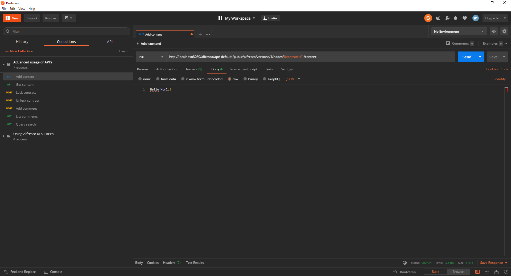
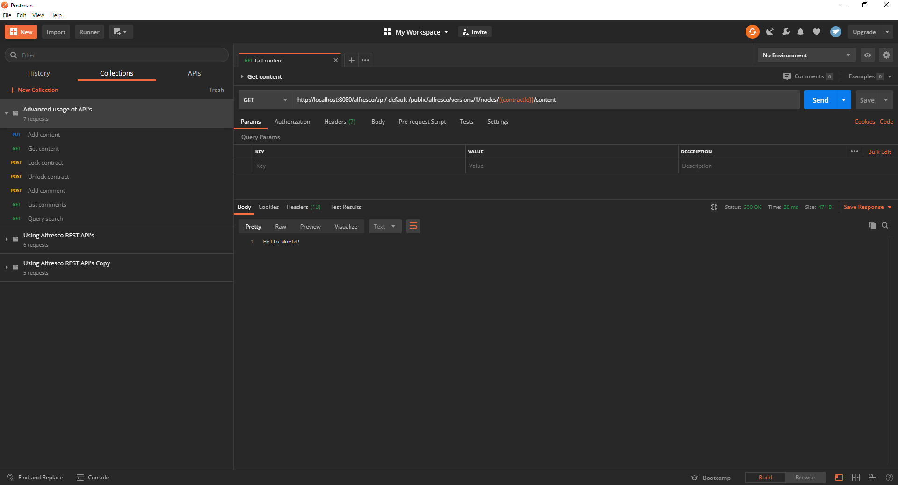
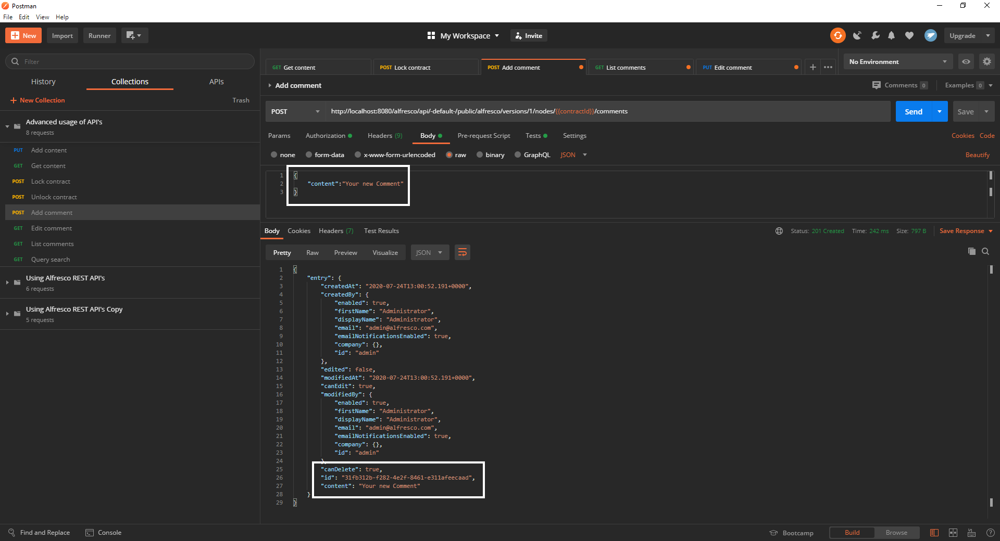
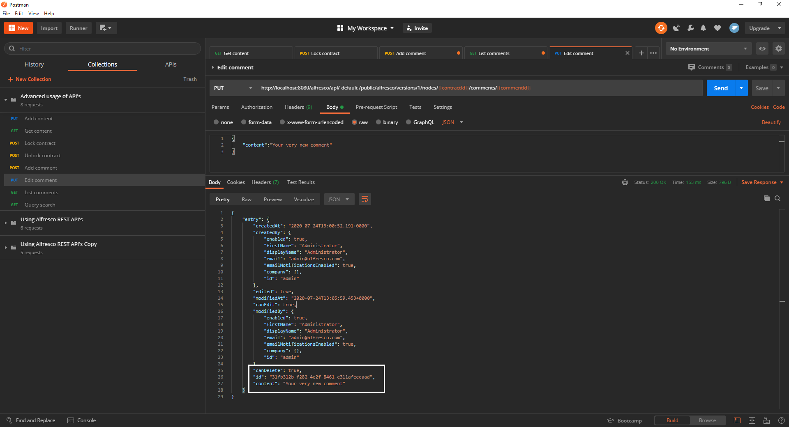
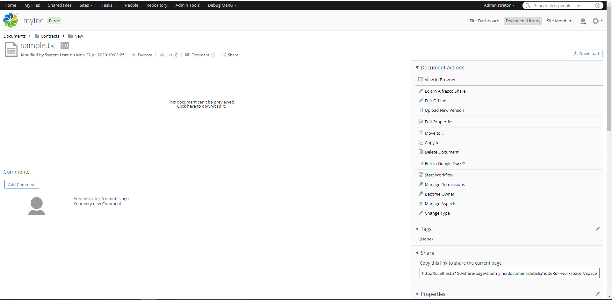
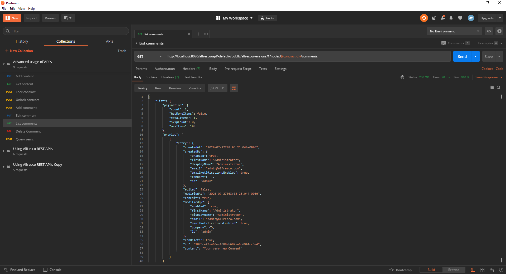
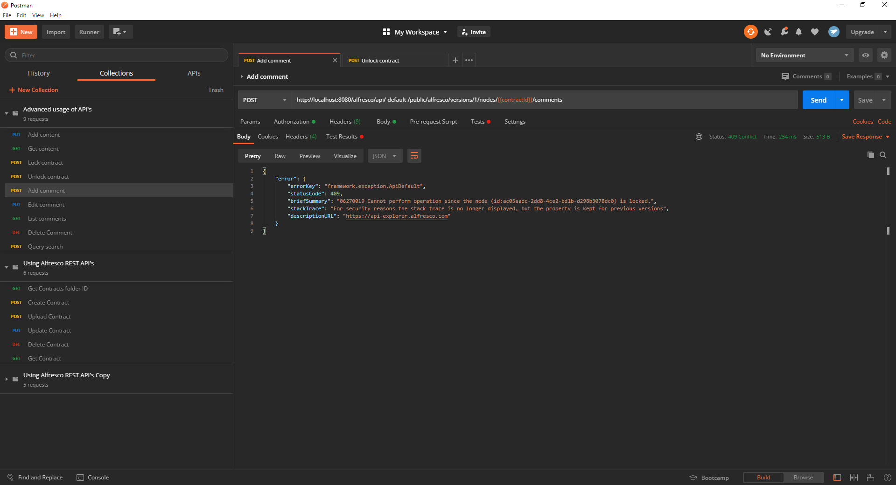
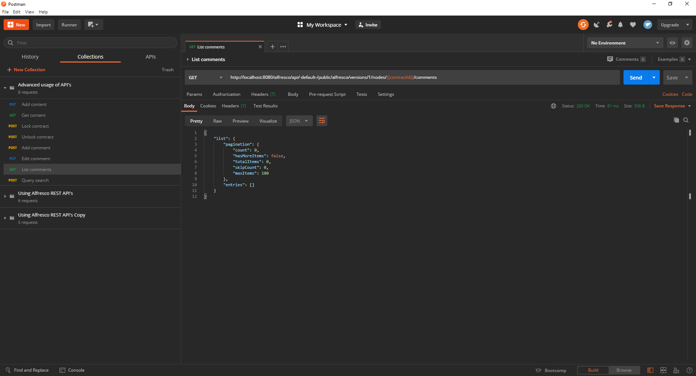

# Guide through advanced operations using Alfresco API’s

API’s are a great way of automating repetitive tasks like uploading content and if used correctly make your application more efficient and less prone to errors.

## Prerequisites

In order to continue you will need [Postman](https://www.postman.com/downloads/) as well as this collection of requests.

This tutorial is a continuation of Working with Alfresco REST API’s, if you are unfamiliar with the Alfresco API’s make sure to check it out. 

If you are already familiar with the basics, the completion of the first tutorial is not strictly necessary. However, certain requests of this collection will not be explained in detail as they were already discussed in the previous guide.

The completion of the [Contract- Management](https://www.alfresco.com/abn/tutorials/contract-management/) series on the other hand is a requirement for you to continue.

At the end of this guide you will be able to:
- Add as well as GET content of your contracts
- Lock and unlock your contracts
- Add comments

## Adding content to your contracts

In the last tutorial you learned how to create an empty contract, so let’s try to fill it with some content this time.  
Run the first two requests of the collection, the first one will get the ID of your "Contracts" folder. After that the second request will create a new contract within it.
If you already completed the first tutorial of this series you can leave out the first request as your {folderId} variable should already be set.

Now that everything is set up, use the third request to add content to your contract. The body of this request simply consists of a string which will be inserted into your file.

Now you can view the content of your contract using postman by executing the fourth request. This is a simple GET request sent to the /nodes/{contractId}/content API.

## Locking and unlocking a contract

Locking a file is used to prevent other users from making changes on your content and is executed by sending a POST request to the /nodes/{contractId}/lock API.
The body of this request consists of three parameter:
- timeToExpire: Time until the content is unlocked again (in seconds)
- Type:
  - ALLOW_OWNER_CHANGES: No one but yourself can make changes
  - FULL: Nobody can change the file
- Lifetime:
  - PERSISTENT: Lock survives repository restart
  - EPHEMERAL: File is unlocked after repository restart

Use the fifth request to lock the contract you’ve just created for 10 minutes then log into share with one of the site- collaborators of myInc, which you created in the [Permissions tutorial](https://www.alfresco.com/abn/tutorials/contract-management/setting-up-permissions/).  
Navigate to your created contract and click it! If everything went correctly you shouldn’t be able to make any changes.

If you use the sixth request now and refresh share in your browser options to edit should be available again.

## Commenting your contracts

The next operation we will cover is commenting, which you can do by executing the seventh request of the collection.  
It will ping the /node/{contractId}/comments API with a simple string “content” which contains whatever you want to comment. Again we will create a variable in the “Test” tab, naming it “commentId” this time.  
The response body will be containing the node you just created:

You can also edit your comment by using the next request which will send a PUT request with your new comment to the /nodes/{contractId}/comments/{commentId} API.  
The response will look similar to the last one except it will contain the updated content of your comment this time around:

If you now visit Share and open your contract you can see your comment right beneath the content.

You can also check your comments via the API’s. Just use the eighth request which simply GETs every comment from the /nodes/{contract}/comments API.

Let’s lock the contract once more and have a look at what happens if you try and comment with a different user.  
Use the "Lock Contract" request again, then click the “Authorization” tab of the "Add Comment" request, choose “Basic Auth” under “Type" and enter the credentials of any user you have created apart from the Administrator.

This is what you should get, when you try to comment now:

Now that you know how to comment try and delete the one you just created by yourself. If you get stuck check out the [Alfresco api-explorer](https://api-explorer.alfresco.com/api-explorer/#/) or read through the spoiler paragraph.  
Note: Create your request inside the collection as it will inherit the needed authorization settings that way. You can do that by hovering over the collection and click the three horizontal dots then select “Add Request”.

Once you created the request change the type to DELETE and copy the URL from the fourth request as it is almost identical to the one you need. The only thing that is missing is the ID of the comment you want to delete. In the “Test” tab of the "Add Comment" request there is a variable being set called “commentId”, use it by adding /{{commentId}} to the URL.  
Once you have done that your request is ready to roll, hit “Send” and check Share if your comment was deleted or use the the “List Comments” request again.
You’ll get an empty “entries” array like so:

## Summary

Now that you have finished this tutorial you are able to fill your contracts with content and check your additions afterwards using the Alfresco REST API’s.
Also you can lock out users from editing your contracts.

While we were focusing on contracts in these guides, everything you did here is applicable to pretty much any other piece of content as well. 

If you want to do more exercises concerning our API’s check out Gavin Cornwells [blog](https://hub.alfresco.com/t5/alfresco-content-services-blog/v1-rest-api-10-things-you-should-know/ba-p/287692) or visit our [documentation of various resources](https://hub.alfresco.com/t5/alfresco-content-services-hub/alfresco-public-rest-apis/ba-p/291250).
