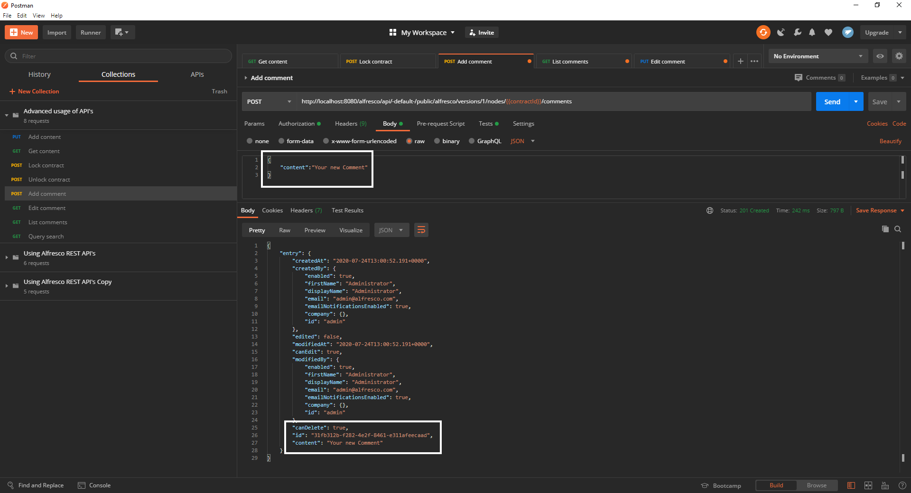
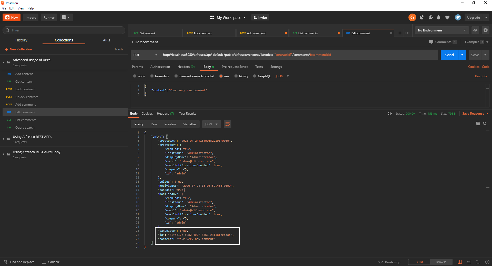

# Guide through advanced operations using Alfresco API’s

API’s are a great way of automating repetitive tasks like uploading content and if used correctly make your application more efficient and less prone to errors.

## Prerequisites

In order to continue you will need [Postman](https://www.postman.com/downloads/) as well as this collection of requests.

This tutorial is a continuation of the Introduction to working with Alfresco API’s, if you are unfamiliar with our API’s make sure to check it out. 

If you are already familiar with the basics the completion of the first tutorial is not strictly necessary. However, we will be reusing some of the requests from the last collection, so be sure to download it.

The completion of the [Contract- Management](https://www.alfresco.com/abn/tutorials/contract-management/) series on the other hand is a requirement for you to continue.

At the end of this guide you will know how to:
- Add as well as GET content of your contracts
- Lock and unlock your contracts
- Add comments
- Search for contracts

## Adding content to your contracts

In the last tutorial you learned how to create an empty contract, so let’s try to fill it with some content this time. 
Since you deleted every contract the last time you will need to create another one with the second request from the last collection.
By executing it you will set the global variable “contractId” to the ID of your created file.
Now that everything is set up for the first request of this tutorial use it to add content to your contract. The body of this request simply consists of a string which will be inserted into your file.

Now you can view the content of your contract using postman by executing the second request. This is a simple GET request sent to the /nodes/{contractId}/content API.

## Locking and unlocking a contract

Locking a file is used to prevent other users from making changes on your content and is executed by sending a POST request to the /nodes/{contractId}/lock API.
The body of this request consists of three parameter:
- timeToExpire: Time until the content is unlocked again (in seconds)
- Type:
  - ALLOW_OWNER_CHANGES: No one but yourself can make changes
  - FULL: Nobody can change the file
- Lifetime:
  - PERSISTENT: Lock survives repository restart
  - EPHEMERAL: File is unlocked after repository restart

Use the third request to lock the contract you’ve just created for 10 minutes then log into share with one of the site- collaborators of myInc, which you created in the [Permissions tutorial](https://www.alfresco.com/abn/tutorials/contract-management/setting-up-permissions/).
Navigate to your created contract and click it! If everything went correctly you shouldn’t be able to make any changes.

If you use the fourth request now and refresh share in your browser options to edit should be available again.

## Commenting your contracts

The next operation we will cover is commenting, which you can do by executing the fifth request of the collection.
It will ping the /node/{contractId}/comments API with a simple string “content” which contains whatever you want to comment. Again we will create a variable in the “Test” tab, naming it “commentId” this time.
 The response body will be containing the the node you just created:

You can also edit your comment by using the next request which will send a put request with your new comment to the /nodes/{contractId}/comments/{commentId} API.
The response will look similar to the last one except it will contain the updated content of your comment this time around:

If you now visit Share and open your contract you can see your comment right beneath the content.

You can also check your comments via the API’s. Just use the sixth request which simply GETs every comment from the /nodes/{contract}/comments API.

Let’s lock the contract once more and have a look at what happens if you try and comment with a different user.
Use the third request again, then click the “Authorization” tab of the fifth request, choose “Basic Auth” under “Type and enter the credentials of any user you have created apart from the Administrator.

This is what you should get, when you try to comment now:

Now that you know how to comment try and delete the one you just created by yourself. If you get stuck check out the [Alfresco api-explorer](https://api-explorer.alfresco.com/api-explorer/#/) or read through the spoiler paragraph.
Note: Create your request inside the collection as it will inherit the needed authorization settings that way. You can do that by hovering over the collection and click the three horizontal dots then select “Add Request”.

Once you created the request change the type to DELETE and copy the URL from the fourth request as it is almost identical to the one you need. The only thing that is missing is the ID of the comment you want to delete. In the “Test” tab of the fourth request there is a variable being set called “commentId”, use it by adding /{{commentId}} to the URL.
Once you have done that your request is ready to roll, hit “Send” and check Share if your comment was deleted or use the the “List Comments” request again.
You’ll get an empty “entries” array like so:

## Searching Contracts

Lastly let’s take a look at the search API of Alfresco, it has loads of customizable aspects to make the search for content as various as possible, but we will only cover the very basics here. If you want to know more about the search API, click [here](https://api-explorer.alfresco.com/api-explorer/#!/search/search).

Let’s create another sample contract to work with. This one will concern a fictional employee of myInc, called John Doe.
We establish this connection by adding the “Employee” aspect to our contract and assigning “John Doe” to  “ct:employeeName” with the “Create Employee Contract” request.

The “Search for Employee Contract” request will return your newly created contract as it looks for every node having the type “ct:contract” and narrowing it further down to the name of the employee it concerns.
Also it will cut certain fields from the response body so that only the ID, name and node type of the contract are left as well as its properties.
As id, name and node type are already included in the response body of a search request they can be put into the “fields” field, which chucks everything from the response except for the elements contained within it.
Properties on the other hand are not returned by default so we have to tell ACS to send them along with the “include” field.
It is very important to note that while you are GETting a specific node (or list of nodes if your search parameters are broader) the request you send is of the type POST.

## Summary

Now that you have finished this tutorial you are able to fill your contracts with content and check your additions afterwards using the Alfresco API’s.
Also you can lock out users from editing your contracts and you now know how to find any given node by its type or name.

While we were focusing on contracts in these guides, everything you did here is applicable to pretty much any other piece of content as well. 

If you want to do more exercises concerning our API’s check out Gavin Cornwells [blog](https://hub.alfresco.com/t5/alfresco-content-services-blog/v1-rest-api-10-things-you-should-know/ba-p/287692) or visit our [documentation of various resources](https://hub.alfresco.com/t5/alfresco-content-services-hub/alfresco-public-rest-apis/ba-p/291250).
