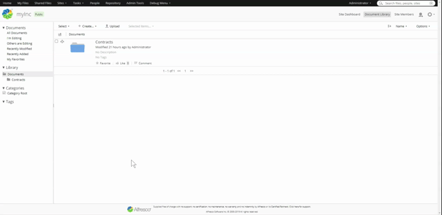
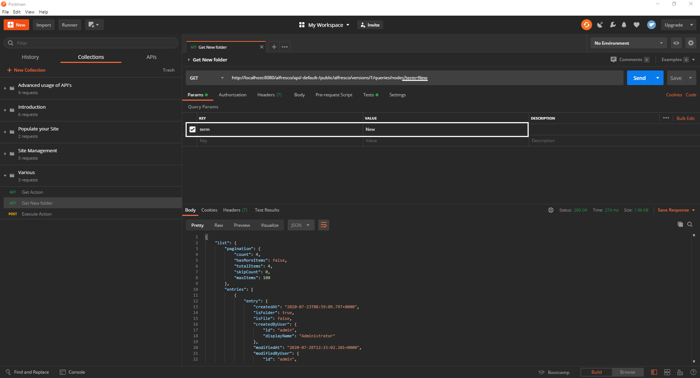
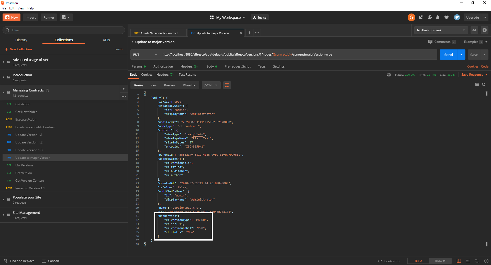
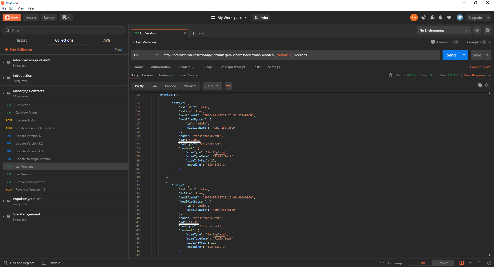
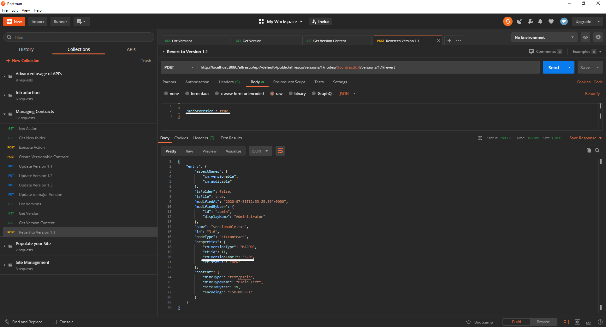

# Managing your contracts with API’s

API’s will help you simplify certain repeatable workflows within your application streamline your code as much as possible.
To ensure your work with ACS is as comfortable as can be Alfresco provides a number of API’s which you can look up [here](https://api-explorer.alfresco.com/api-explorer/#/).

This tutorial will guide you through the more specific API’s of Alfresco:
- Listing and executing actions
- Versioning your nodes

## Prerequisites

In order to continue you should have completed our [Contract Management](https://www.alfresco.com/abn/tutorials/contract-management/) series as well as the first two entries in this one:
- Introduction to Alfresco API’s
- Advanced operations

[Postman](https://www.postman.com/downloads/) is also a requirement for you to be able to continue.

To have an easier time following this tutorial import this collection of requests.

## Listing and executing actions
In the Contract Management series you already used actions to structure your site and move files into appropriate folders according to their status.
For our next steps to succeed you have to disable the “Move to New” rule you set up on your “Contracts” folder.
To do so hover over it, select “Manage Rules” then click the “Move to New” rule and select “Edit”. Next tick the box labeled “Disable Rule”.

This is necessary as we want to invoke the “Move” action manually now and the rule you just disabled would have chucked the contract right back into the “New” folder making it impossible to check whether the move worked.

But before we move anything let’s have a look at the action first.
To do that you need to send a send GET request to the action-definitions/{actionId} API, coincidentally the first request of the collection does just that.
The Id-ing of actions is much more intuitive compared to files and folders as they are identical to their name only written in all lowercase letters.

Okay, let’s go through the action bit by bit: The first part is an array telling you which node types the action is applicable on. If the array is empty, as is the case here, you can apply the action to any type.
Next we have “parameterDefinitions”, an array, the entries of which are the parameters you have to send if you want to execute this action. Move has only one - “destination-folder” - the name of the parameter is the string you will use to specify it in the body of your execution request. The entry also tells you of which type the parameter has to be and if it is mandatory to define if you want to execute the action. 

There are two last things we have to do before we can move contracts around:
- Save the “New” folder-ID under a variable
- Create a contract to move 

 To be able to execute the action we need the ID of the “New” folder where the contract is supposed to go. The second request of the collection does that by submitting a GET request to the queries/nodes API containing the title of the folder we need.

Queries are used to find nodes using a single term or phrase, which can either be specified in the “Params” tab of Postman or in the URL itself.

In the “Test” tab Postman grabs the first entry of the returned list and saves it under the “newFolderId” variable for you to use in the next request.

And lastly use the “Create Contract” request from the first tutorial and name the contract “moveTest.txt”. Because you disabled the “Move to New” rule the file will remain outside the subfolders of “Contracts” for you to be moved to “New”.
Should {folderId} be undefined, execute the first request to assign the ID of the “Contracts” folder to it.
Make sure that your contract really didn’t enter the “New” folder, before continuing.

You are finally ready to move a contract now, just execute the third request, which will ping the /action-executions API with the name of the action, the ID of the contract that is supposed to be moved and the ID of the destination folder.
But since the type of “destination-folder” was “d:noderef” the folder ID alone doesn’t suffice.
It also needs the path to said folder.

In the response body you can see the unique ID of the action you have just performed. 

## Versioning

Next up versioning can be very useful if you want to be able to revert to a previous state of a contract, be it because a certain clause was tossed or a party withdrew.

Let’s start by creating a versionable contract by using the request with the same name from the collection.
It works very similar to the “Create Contract” request from the first tutorial, only this time you are telling ACS to add the aspect “cm:versionable” to it as well.

If you are making a contract versionable the property called “auto-version” is automatically turned on, which means that every time you update your contract there will be a minor version update as well, turning the version from i.e. 1.0 to 1.1.

Let’s create a few versions of your new contract. You can do so by executing requests 5 through 7 manually one by one or use the Postman “Runner”.

The “Runner” is used to execute multiple requests automatically and in sequence. To use it click “Runner” in the upper left corner of the screen then select the collection you want and mark the correct requests.
After that click “Run Managing Contracts” and you have three new versions of your contract.

Now that you have 3 minor version updates let’s add a major one as well. For that use the ninth request which is very similar to the previous three with the exception of the “majorVersion” parameter in the URL and “Params” tab.

To have a look at the version history of your contract run the next request to list your versions with information about the name of the file, the version id and the node type among other less important facts, less important for our use case anyway.

You can also get information on specific versions in greater detail adding fields like “properties” and “aspectNames”.
To get details on version 1.1 run the request “Get Details”!

If you want to view the content, the last two API’s aren't much use, content can only be accessed for a specific version at a time.
This is what the next request is for, execute it to see the content of version 1.1.

And lastly you can revert to any previous version by sending a post request to the nodes/{contractId}/versions/{versionId}/revert API as is demonstrated in “Revert Version” of the Postman collection.
Although you are reverting to a previous version, the request will be handled as an update, therefore the version numeration will be continued.
In the body of this request you can determine whether this should be regarded as a major or minor version update with the boolean property “majorVersion”.

## Summary

After this tutorial you are able to perform any action on any node on your system using the Alfresco API’s.

Also you can create and revert versions of your content to reestablish specific states of your files should the need arise.

If you want to do more exercises concerning our API’s check out Gavin Cornwells [blog](https://hub.alfresco.com/t5/alfresco-content-services-blog/v1-rest-api-10-things-you-should-know/ba-p/287692) or visit our [documentation of various resources](https://hub.alfresco.com/t5/alfresco-content-services-hub/alfresco-public-rest-apis/ba-p/291250).

