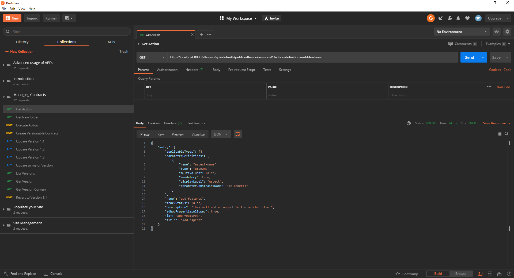
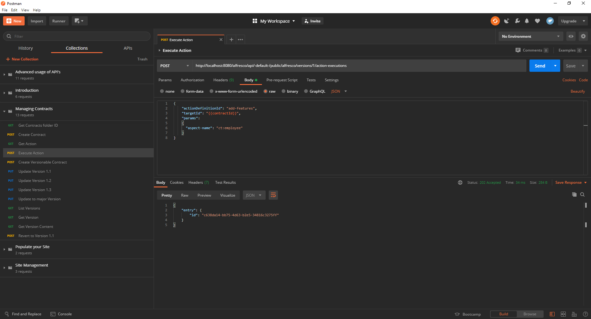
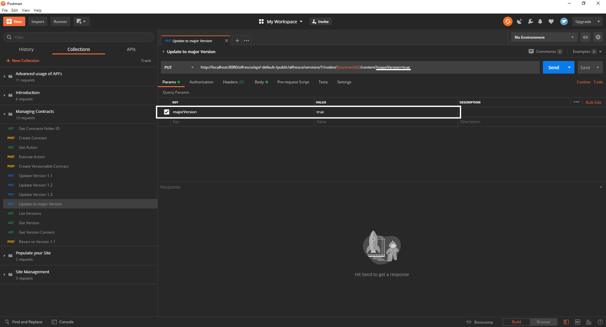
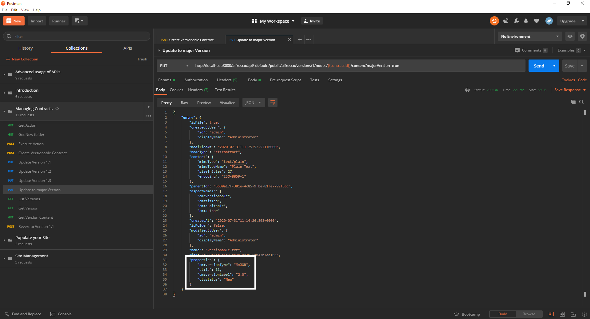
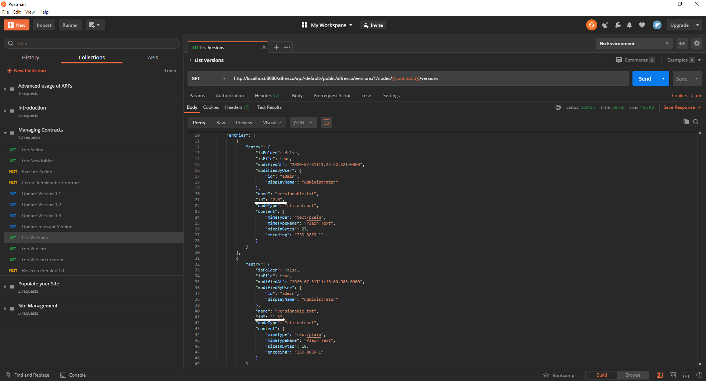
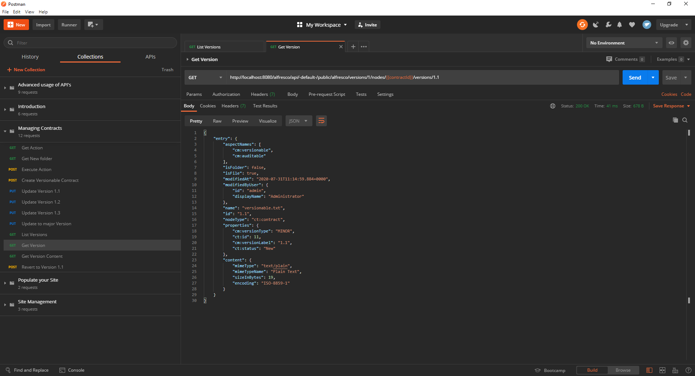
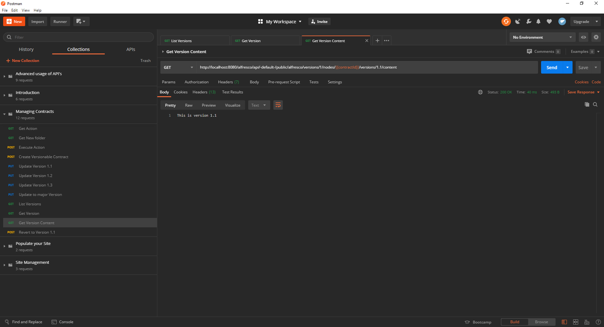
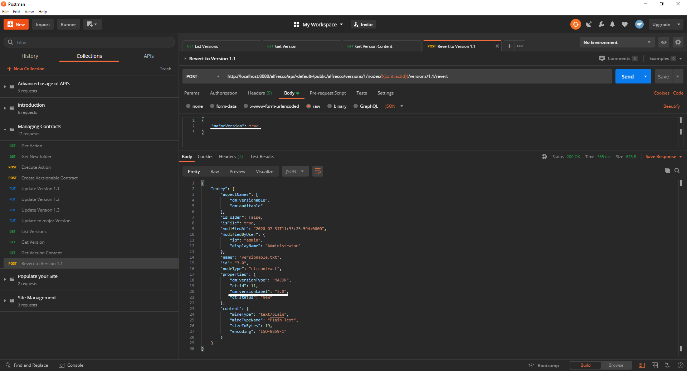
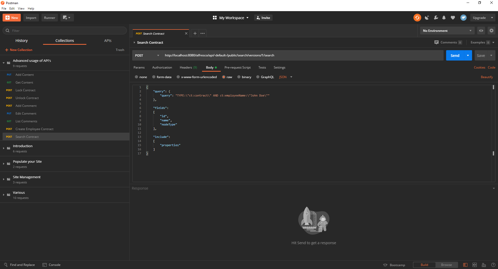
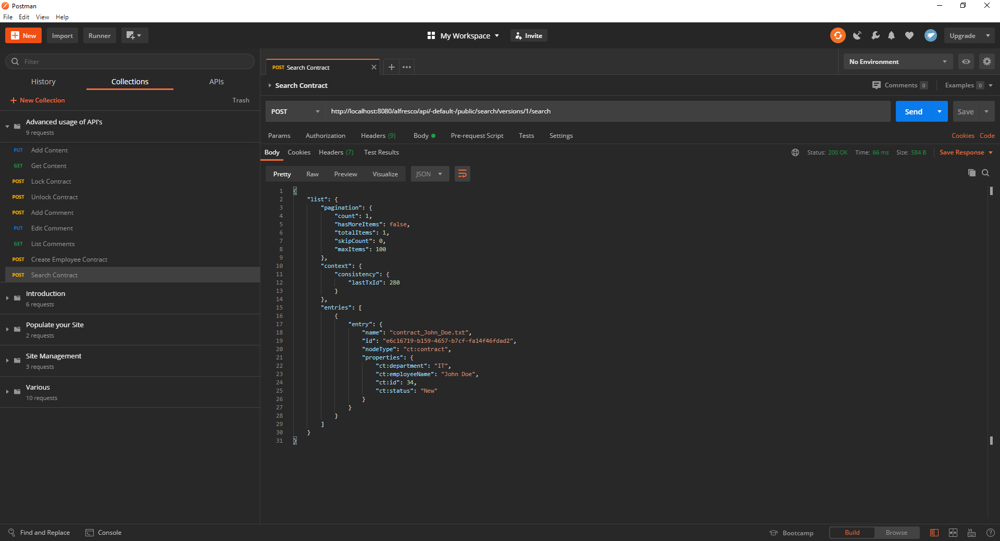

# Managing your contracts with REST APIs

This tutorial is a continuation of [advanced operations using Alfresco REST APIs](advancedOperations.md), if you are unfamiliar with the Alfresco REST APIs make sure to check it out. 

This tutorial will guide you through the more specific REST APIs of Alfresco:
- Listing and executing actions
- Versioning of your nodes
- Searching for nodes

## Prerequisites

In order to continue, you should have completed our [Contract Management](https://www.alfresco.com/abn/tutorials/contract-management/) series as well as the first two entries in this one:
- [Working with Alfresco APIs](introduction.md)
- [Advanced operations](advancedOperations.md)

[Postman](https://www.postman.com/downloads/) is also a requirement for you to be able to continue.

To have an easier time following this tutorial import this collection of requests.

## Listing and executing actions
In the Contract Management series you've already used actions to structure your site and move files into the appropriate folders according to their status.

Before we continue you will have to create a contract to work with in the following steps.  
For that run the first two requests of the collection, the first one will get the ID of your `Contracts` folder. After that the second request will create a new contract within it.  
If you already completed any of the preceeding tutorials of this series you can leave out the first request as your `{folderId}` variable is already set.

Now we will use the Alfresco REST APIs to add an aspect to a your contract.  
You're maybe thinking: "But wait, I already did that in the introduction tutorial by updating my contract with the `/nodes` API." and you would be right, but...  
If you wanted to add an aspect to a contract using the `/nodes` API you would have to list every aspect already assigned to the node plus the one you want to add.
Otherwise you would just replace the "old" aspects.  
It was a valid route for you to take in the introduction as it was the first aspect you added but if you have a look at the contract you just created you'll see that it already has `cm:versionable` assigned to it.  
More on that aspect later.

Let's have a look at the action you are about to use.  
To do so you need to send a send GET request to the `/action-definitions/{actionId}` API, coincidentally the third request of the collection does just that.  
The Id-ing of actions is much more intuitive compared to files and folders as they are identical to their name only written in all lowercase letters.

Okay, let’s go through the action bit by bit: The first part is an array telling you which node types the action is applicable to. If the array is empty, as is the case here, you can apply the action to any type.  
Next we have `parameterDefinitions`: The entries of this array tell you which parameters you have to define when you want to execute this action. `add-features` has only one - `aspect-name` - the name of the parameter is the string you will use to specify it in the body of your execution request. The entry also tells you which type the parameter has to be of and if it is mandatory to successfully execute the action. 

Now it's time to add an aspect to your contract, so go ahead and run `Execute Action`, which will ping the `/action-executions` API with the name of the action, the ID of the concerned contract and the name of the aspect you want to add, in this case `ct:employee`.

In the response body you can see the unique ID of the action you have just performed. 

Lastly let's name the employee the contract concerns by updating it with the fifth request.  
This is important for a later step in this tutorial.

## Versioning

Next up versioning can be very useful if you want to be able to revert to a previous state of a contract, be it because a certain clause was tossed or a party withdrew.

Luckily you've already created a versionable contract in the last step.  
If you make a contract versionable the property called `auto-version` is automatically turned on, which means that every time you update your contract there will be a minor version update as well, turning the version from i.e. 1.0 to 1.1.

Let’s create a few versions of your new contract. You can do so by executing requests 6 through 8 manually one by one or use the Postman `Runner`.

The `Runner` is used to execute multiple requests automatically and in sequence. To use it click `Runner` in the upper left corner of the screen then select the collection you want and mark the correct requests.
After that click `Run Managing Contracts` and you have three new versions of your contract.

Now that you have 3 minor version updates let’s add a major one as well. For that use the ninth request which is very similar to the previous three with the exception of the `majorVersion` parameter in the URL and `Params` tab.

To have a look at the version history of your contract run the next request to list your versions with information about the name of the file, the version id and the node type among other less important facts, less important for our puposes anyway.

You can also get information on specific versions in greater detail adding fields like `properties` and `aspectNames`.  
To get details on version 1.1 run the request `Get Details`!

If you want to view the content, the last two APIs aren't much use, content can only be accessed for a specific version at a time.  
This is what the next request is for, execute it to see the content of version 1.1.

And lastly you can revert to any previous version by sending a post request to the `nodes/{contractId}/versions/{versionId}/revert` API as is demonstrated in `Revert Version` of the Postman collection.
Although you are reverting to a previous version, the request will be handled as an update, therefore the version numeration will be continued.  
In the body of this request you can determine whether this should be regarded as a major or minor version update with the boolean property `majorVersion`.

## Searching Contracts

Lastly let’s take a look at the search API of Alfresco.  
This API gives you access to the Alfresco search engine, letting you customize almost every aspect of your query as well as tailor the response body to your needs as will be demonstrated below.
You can learn more about the search API and explore different fields to make your request as specific as possible [here](https://api-explorer.alfresco.com/api-explorer/#!/search/search).  
We encourage you to take a look at the possibilities the search API offers and construct your own custom request and expiriment with what you can do.

The `Search for Employee Contract` request will return the contract you created earlier as it looks for every node having the type `ct:contract` and narrowing it further down to the name of the employee it concerns.  
Also it will cut certain fields from the response body so that only the ID, name and node type of the contract are left as well as its properties.  
As id, name and node type are already included in the response body of a search request they can be put into the `fields` field, which chucks everything from the response except for the elements contained within it.
Properties on the other hand are not returned by default so we have to tell ACS to send them along with the `include` field.
It is very important to note that while you are GETting a specific node (or list of nodes if your search parameters are broader) the request you send is of the type POST.

## Summary

After this tutorial you are able to perform any action on any node on your system using the Alfresco REST APIs.

Also you can create and revert versions of your content to reestablish specific states of your files should the need arise and utilize the Alfresco search API as well as tailor it's response to your needs.

If you want to do more exercises concerning our REST APIs check out Gavin Cornwells [blog](https://hub.alfresco.com/t5/alfresco-content-services-blog/v1-rest-api-10-things-you-should-know/ba-p/287692) or visit our [documentation of various resources](https://hub.alfresco.com/t5/alfresco-content-services-hub/alfresco-public-rest-apis/ba-p/291250).

## Next Steps

Now that you know basic practices on how to work with contract you could refresh your memory on some more basic operations with the last two entries in this series:

- [Introduction](introduction.md)
- [Advanced Operations](advancedOperations.md)
- **Contract Management**

Also you can check out the [blog series by Gavin Cornwell on the Alfresco hub](https://hub.alfresco.com/t5/alfresco-content-services-blog/v1-rest-api-part-1-introduction/ba-p/286874), giving you additional interesting use cases on how to use APIs.   
Or you could check out the following links to find out more about how APIs work:

- [API explorer](https://api-explorer.alfresco.com/api-explorer/#/)
- [API guide](https://docs.alfresco.com/6.0/concepts/dev-api-intro.html)
- [Documentation of various resources](https://hub.alfresco.com/t5/alfresco-content-services-hub/alfresco-public-rest-apis/ba-p/291250)
