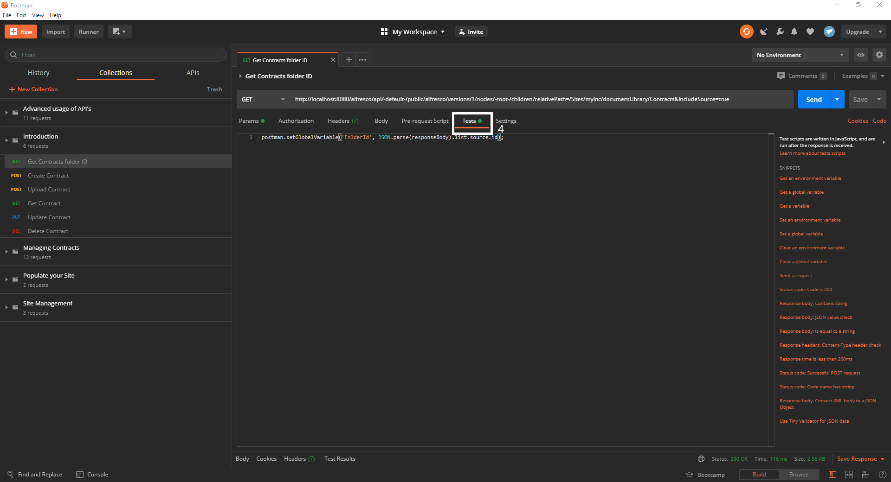
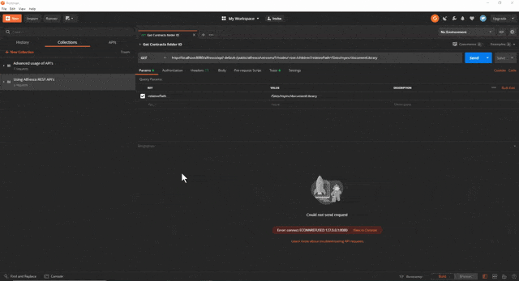
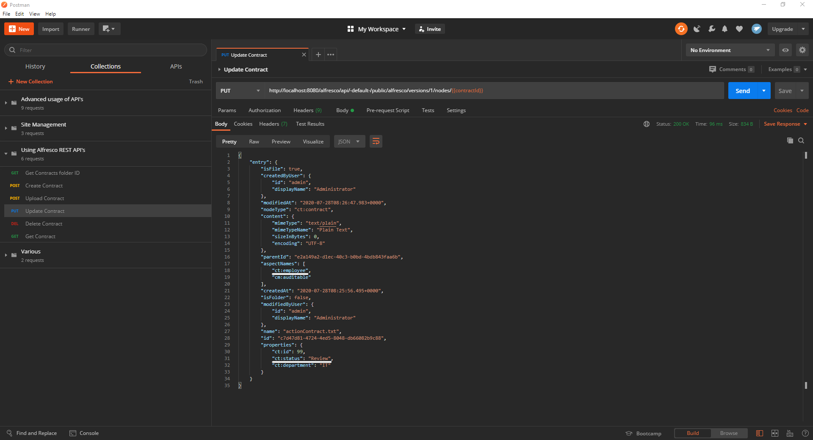

# Introduction to working with Alfresco API’s

The following tutorial will show you how to utilize Alfresco API’s to interact with ACS using [Postman](https://www.postman.com/downloads/).
 
It will take you through the basic steps of:
- Creating a node
- Uploading content
- Updating a node
- And deleting a node in Alfresco ACS.

  
## Prerequisites

The following examples will be building on the [Contract Management](https://www.alfresco.com/abn/tutorials/contract-management/) tutorials, so be sure to check them out before continuing. 

A quick word on Postman if you never used it before: It basically builds a request out of parameters you provide.
So you only need to worry about three things: 
- What kind of request do you want to send
- Where do you want to send it
- What it contains (i.e. files, properties, parameters)

Everything else will be taken care of by Postman.

Also you will need this collection of pre-made requests to spare you from creating them yourself. 

[](https://www.getpostman.com/run-collection/bfc6b4dd5f3ec21ddb8d)


While this introduction will explain all the parts of these requests, feel free to experiment with them and get a feel of what happens when you change certain parameters. 
  

## Requests
There are quite a few request types. In this tutorial we will be focusing on four:
- GET
- POST
- PUT
- DELETE


If you want to get to know more, click [here](https://developer.mozilla.org/en-US/docs/Web/HTTP/Methods).

GET requests call for already existing data on your ACS system and are typically used to get an index of nodes in a certain location.

The POST request is used to create new content or folders or upload local files.

PUT requests update your nodes by adding or overwriting properties.

And finally the DELETE request does pretty much what you’d expect: It deletes content and folders.

Note that the Postman collection uses the Administrator credentials to execute all operations so it won’t be hindered by the permission restrictions that might have been set up in the Contract Management series.


## What is an API
You can picture an API (Application Programming Interface) as the middleman between the client software - in this case Postman - and the provider - here ACS.
It takes the request of the client and translates it so the provider knows what to do, then relays the answer of the provider back to the client.

The way Alfresco API URL’s are built is very straightforward: They all use the same root (http://address:andPortOfYourAcsInstance/alfresco/api/-default-//public/alfresco/versions/1/).
From here on in it works its way down from the top- level, like nodes, people or sites, over the instance- id to the property of the instance you want to edit or view. 

So if you wanted to GET every child of a folder, you’d call:  
/nodes/{folderId}/children

ACS provides API’s for a lot of operations, if you want to get an overview and familiarize yourself with the URL structure click [here](https://api-explorer.alfresco.com/api-explorer/#/).


## Creating a contract
If you finished our [Contract Management](https://www.alfresco.com/abn/tutorials/contract-management/) series you will already have created a site called “myInc” and a “Contracts” folder within it.
Now let’s tell ACS to create another contract inside it.
To do so you need to give the Alfresco API the appropriate node ID so it knows where the newly created content is supposed to go. 
To get the ID of the Contracts folder use the first command of the collection.The basic API /nodes/-root-/children (1) will return every child node of your root directory. The “relativePath” parameter (2) will shift that directory to the “Document Library” of your site.
Now that you have the Contracts- folder, the Test- section of the request is going to drill down to the id property of it and assign it to a global variable to be used later on.



If everything went well the response body(3) should look like this:


To a GET request there are mainly two error codes which could occur:
- 404 not found 
- 401 Authentication failed

The first one means that ACS couldn’t find a node with your specifics, a reason could be a typo in the “realtivePath” value.

The second one means you couldn’t log into ACS. Since the collection uses admin/admin (default credentials) it is most likely that you changed the credentials in Share.
If not you can check whether the collection indeed uses admin/admin by clicking on the horizontal dots next to the collection then select edit and open the “Authentication” tab.



After retrieving and saving the ID of the Contracts- folder you can now create a new Contract within it.
For that use the second request of the collection.
Here Postman will send a POST(1) request to the /nodes API using the id variable(2) you created in the last request. In the request body(3) there will only be a name and the type you want your file to have (ct:contract)(4). Note that the body is written in JSON(5).
If you wanted to create a more generic document you could use cm:content or cm:folder if you want to create a folder.
In the test section we will again create a variable for the contract, so we can use it in the next chapters.


This is how your response should look like:



Should you try to define a type that doesn’t exist you will get a 400 error code as response with the body telling you that you have used an invalid type:


If you try to use a non existing prefix you will also get a 400 error code, this time saying that the prefix is wrong:


If you already have a contract you want to upload you can use the same API, only this time instead of sending a json body you will attach the existing contract to your request by using the “form-data” body(1) (Request 3).
Select the file you want to upload as value for the “filedata”- key(2).


Now let’s check if everything worked as it should have! Log into Share as Administrator and and visit your site “myInc” then navigate to the “New” folder (Document Library -> Contracts -> New).
If everything has gone to plan there should be the contract you just created or uploaded.


## Update a contract
Now that you have created and uploaded some contracts let’s change the status of the one you saved earlier. 

“Status” was a property you created in the Content Model tutorial for the custom type “Contract”.
It could have three values:
- New
- Review
- Approved

Currently the status of the contract you created is set to “New”, let’s set it to “Review”.

To change the status you will send a json body with the properties you want to change. It is important to give the full and exact path to your property. In this case it would be “properties -> status”.
If you are unsure where a property is stored you can execute the last  request and look it up in the response body:


In the “Update Contract” request the body is already filled out with the correct path(1) and if you execute it your response body(2) will look like this:


Now check Share again and make sure your contract is now stored in the “Review” folder.


## Deleting a contract
The last part of this short introduction to API’s will cover how to delete a contract. For that we use the fifth request.

This will send a DELETE request to the nodes/{contractId} API. DELETE requests don’t require a body as they only need to know which node to delete.
This is how your response should look like:


In this instance it’s important to pay attention to the Status Code that is sent with the response body. If everything is okay there will be a 204 “No Content” code like in the screenshot above.
If you however try to delete a non existent node there will be a 404 “Not Found” code like so:


Visit Share one last time and check if the contract was deleted.


## Summary
After completing this introduction you are able to work with the basic Alfresco API’s and compose requests to manage basic properties of your contracts.

If you want to make sure you have the basic skills for working with our API’s down, why don’t you try and create a folder as a sibling of “Contracts”, then upload a contract into it.
After that rename your new contract and make sure it worked by GETting the node.
When that succeeds, you can delete both the contract and the folder. If you can do that without peeking at the solution you are well equipped for using our API’s.

To create a sibling of the “Contracts” folder you have to shift the root directory from the first request one level up so as to get the ID of the “Document Library” folder. Then use the second request and change the type in the body from “ct:contract” to “cm:folder” and the variable set in the “Test” tab from “contractId” to “folderId”.
Once you have done that use it again with all changes reversed to create a contract inside your new folder.
Renaming is just another way of saying “updating a property”, this time it’s the “name” property, so use the third request and just replace:


```
{
 “properties”:
	{
		“status”: “Review”
	}
}
```

with
 
```
{
	“name”: “nameOfYourChoice”
}
```

Now there are two ways to let ACS give you your new contract;
The first is to send a GET request to the /nodes/{folderId}/children to display all children of your folder, which is only your contract.
The second one is more specific and in most cases the better option. If you want information on a certain node you simply send a GET request to the /node/{contractId} API.

And lastly, to delete your folder and contract first make sure that your variables are set to the right nodes then send a DELETE request to /nodes/{contractId} and /{folderId} in turn.
It is also possible to delete the folder directly as this will delete the contract within as well.

If you >! want !< to know more about how to work with API’s and dive in a little deeper, check out Gavin Cornwell's [blog](https://hub.alfresco.com/t5/alfresco-content-services-blog/v1-rest-api-part-1-introduction/ba-p/286874) or continue with the second part of this series.
