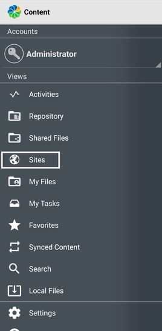

# Connecting your trial to your phone

Now that you have a functional site up and running, let’s connect your trial to the ACS mobile app.  

Alfresco offers native mobile applications for both [Android](https://play.google.com/store/apps/details?id=org.alfresco.mobile.android.application) and [iOS](https://apps.apple.com/us/app/alfresco-content-services/id459242610).

In addition to installing the application you will ned the URL for your Alfresco Content Services instance. 

You can find your URL in the first email with the login information or you can find it by opening the login screen of ACS and copying the part until “alfresco.com”.
 
 
## Setting up on Android

After you installed and opened the app you’ll have to enter the address you want to connect to, in this case your online trial account.

 

 

The address above is only an example. Enter the URL to ACS and add “/alfresco”. Make sure to not add a second “/” after “alfresco” as the application won’t recognize the address like this.

Next you’ll be asked for your login information. They are the same you used for your trial:  
Username: activation mail address  
Password: password you chose.

 

 

Once logged in you will see your hub from where you can manage your account and access your site under “Sites”.

 

 

Now you can navigate your site just like in the browser. In the screenshot below there's the "Employee Contracts/By Department/IT" smartfolder you created in the last tutorial with some example documents.

 

 
 

## Setting up on iOS

After you install the app you'll be asked login. Here you need to enter the URL for your trial - see instructions at the top of this document. 

 

Click "Next" in the top right corner and now you will have to enter your username and password.

 
 
Once you're logged in you can now browse around and manage your content directly from your phone.

## Connecting the mobile app to your download trial

If you are using the 30 days download trial of ACS you can connect to it via the IP- address of your PC inside your WiFi- network on port 8080.

Note that your cell phone has to be logged into the same network for the connection to work.

 
 

## Summary

The native mobile applications for Alfresco Content Services offer a quick and easy way to access and manage your content on the go. Please take some time to explore the capabilities of the application. If you’re interested in learning more about our mobile applications checkout these resources:  

- [Setting up Alfresco Content Services mobile app (Android)](https://docs.alfresco.com/android/topics/mobile-setup.html)
  
- [Using Alfresco Content Services mobile app (Android)](https://docs.alfresco.com/android/topics/mobile-using.html)
  
- [Setting up Alfresco Content Services mobile app (iOS)](https://docs.alfresco.com/ios/topics/ios-mobile-setup.html)
  
- [Using Alfresco Content Services app (iOS)](https://docs.alfresco.com/ios/topics/ios-mobile-using.html)

 
 

## Next Steps

At this point you should be able to access your established site from anywhere you want and tailor it to your needs.

Your are all set up and braced now for what ACS has to offer but if you want to have another look at the preceding tutorials follow these links:

- [Getting started with Content Modeling](content-model.md)
- [Setting up Rules](setting-up-rules.md)
- [Permissions](setting-up-permissions.md)
- [Smart Folders](smart-folders.md)
- **Connect mobile app to Alfresco**