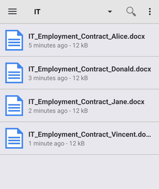

# Connecting your trial to your phone

Now that you have a functional site up and running let’s connect your trial to the ACS mobile app.  
ACS supports both [Android](https://play.google.com/store/apps/details?id=org.alfresco.mobile.android.application) and iOS.

After you installed and opened the app you’ll have to enter the address you want to connect to, in this case your online trial account.

 

 

The address above is only an example as every trial has a unique URL. You can find yours by opening the login screen of your trial and copying the part until “alfresco.com”, paste it into the app and add “/alfresco”. Make sure to not add a second “/” after “alfresco” as the application won’t recognize the address like this.

Next you’ll be asked for your login information. They are the same you used for your trial:  
Username: activation mail address  
Password: password you chose.

 

 

Next you will see your hub from where you can manage your account and access your site under “Sites”.

 

 

Now you can navigate your site just like in the browser. In the screenshot below you can see the "Employee Contracts/By Department/IT" smartfolder you created in the last tutorial with some example documents.

 

 

If you are using the 30 days download trial of ACS you can connect to it via the IP- address of your PC inside your WiFi- network on port 8080.  
Note that your cell phone has to be logged into the same network for the connection to work.
