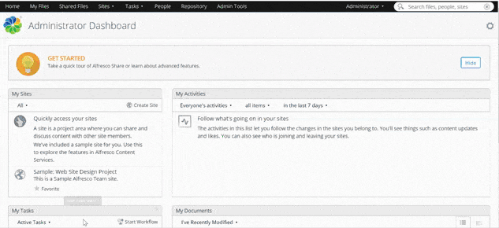
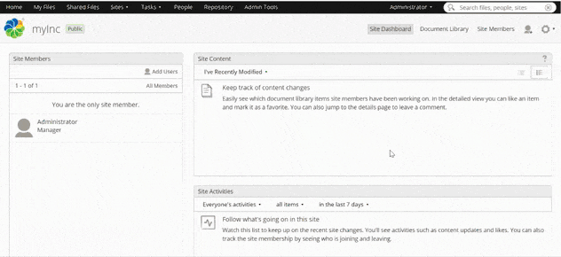
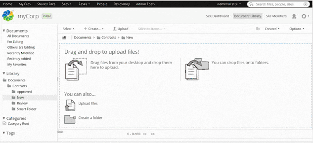

# Getting started with Content Modeling

Content modeling is a fundamental building block of Alfresco Content Services that provides a foundation for structuring and working with content. 

A content model allows you to define relevant metadata that is applied to your content which can later be used for your business requirements such as Content Rules, Search and much more.

The purpose of this tutorial is to show you some of the powerful modeling capabilities in the Alfresco Platform. To achieve this we will use a basic Contract Management solution as an example, but keep in mind that this is only an example, content models come in all shapes and sizes depending on your business requirements and use case. 

At the end of this tutorial you will have created a content model for a contract which will specialize uploaded documents as contracts and add metadata depending on the type of contract.

 
 

## Prerequisites
To complete this you need to have the latest Alfresco Content Services up and running. We suggest to [spin up an online trial](http://alfresco.com/try-acs) or [download the 30 day trial](https://www.alfresco.com/platform/content-services-ecm/trial/download). 

 
 

## Glossary
As we advance into the Alfresco platform it’s easy to lose track of all the different moving parts. Here’s a cheat sheet with the different product areas and namings we will be using moving forward:  
- ACS = Alfresco Content Services  
- ADW = Alfresco Digital Workspace  
- Share = Web application that offers some configuration and administration features

 
 

## Creating your first Content Model

Now that you have ACS running, you need to log in to “Share”. If you are running an [online trial](http://alfresco.com/try-acs) the link to Share will be in the email you received along with the login credentials. 

If you’re running the [download trial](https://www.alfresco.com/platform/content-services-ecm/trial/download) using Docker, you can most likely access Share through http://localhost:8080/share - the default credentials are admin / admin.

Once you’re logged in click on “Admin Tools” at the top of the screen, then find “Model Manager” in the sidebar.

Now click “Create Model” and give your model a namespace: For this tutorial let’s use “http://www.example.com”. Also you have to give your Model a name and prefix, type in “Contracts” and “ct” for that.

After naming your Content Model let’s fill it with a Custom Type and some Aspects.

 

***… a quick note on Types and Aspects***  
A Custom Type is a set of properties every document of a specific category must have.
If you think of documents as vehicles, a Custom Type could be “Car”, the properties every car has are an engine, wheels, and a steering wheel.

Aspects are also a set of properties, but are not bound to one type. To use the metaphor again: After you declared your vehicle a car it has an engine, wheels and a steering wheel. An Aspect could be “Deluxe Package”, which would add heated seats, air conditioning and memory seats. This Aspect could also be used for other Custom Types like Bus or Boat.

 

But let’s get back to your Content Model: Click “Create Custom Type” and give it a name and display label like this:

 

It is good form to use camelCase for name.

 

After you created the Custom Type click on its name to display its properties, since you didn’t add any so far this site should be empty. Let’s change that.
Click on “Create Property” and type in:

 

|  Property       |  Value      |
|  ---            |  ---        |
|  Name           |  id         |
|  Display Label  |  ID         |
|  Data Type      |  Long       |
|  Requirement    |  Mandatory  |

 

|  Property       |  Value       |
|  ---            |  ---         |
|  Name           |  draftDate   |
|  Display Label  |  Draft Date  |
|  Data Type      |  Date        |
|  Requirement    |  Mandatory   |

 

|  Property       |  Value        |
|  ---            |  ---          |
|  Name           |  reviewDate   |
|  Display Label  |  Review Date  |
|  Data Type      |  Date         |
|  Requirement    |  Optional     |

 

|  Property       |  Value             |
|  ---            |  ---               |
|  Name           |  dateOfApproval    |
|  Display Label  |  Date of Approval  |
|  Data Type      |  Date              |
|  Requirement    |  Optional          |

 

|  Property        |  Value                         |
|  ---             |  ---                           |
|  Name            |  status                        |
|  Display Label   |  Status                        |
|  Data Type       |  Text                          |
|  Requirement     |  Mandatory                     |
|  Default Value   |  New                           |
|  Constraint      |  List of Values                |
|  List of Values  |  New   Review  Approved  |

 

Now that you have the basic properties for every contract, let’s create some more specified properties with Aspects. Head back to “Custom Types and Aspects” and click “Create Aspect”, then type the following:

 

 

|  Property       |  Value     |
|  ---            |  ---       |
|  Name           |  employee  |
|  Display Label  |  Employee  |

 

Click “Create” and make another one.

 

|  Property       |  Value   |
|  ---            |  ---     |
|  Name           |  vendor  |
|  Display Label  |  Vendor  |

 

Now you have two unpopulated Aspects. Hit the name of “employee” and click “Create Property” on the following screen. Then create the following Properties:

 

|  Property        |  Value                           |
|  ---             |  ---                             |
|  Name            |  department                      |
|  Display Label   |  Department                      |
|  Data Type       |  Text                            |
|  Requirement     |  Mandatory                       |
|  Default Value   |  ---                             |
|  Constraint      |  List of Values                  |
|  List of Values  |  IT   HR  Sales  Legal  |

Tick “List Alphanumerically”

 

|  Property       |  Value          |
|  ---            |  ---            |
|  Name           |  employeeMail   |
|  Display Label  |  Employee Mail  |
|  Data Type      |  Text           |
|  Requirement    |  Mandatory      |

 

|  Property       |  Value       |
|  ---            |  ---         |
|  Name           |  employeeId  |
|  Display Label  |  Empoyee ID  |
|  Data Type      |  Long        |
|  Requirement    |  Mandatory   |

 

|  Property        |  Value                    |
|  ---             |  ---                      |
|  Name            |  employeeName             |
|  Display Label   |  Employee Name            |
|  Data Type       |  Text                     |
|  Requirement     |  Mandatory                |
|  Constraint      |  Minimum/ Maximum Length  |
|  Minimum Length  |  1                        |
|  Maximum Length  |  60                       |

 

|  Property       |  Value                  |
|  ---            |  ---                    |
|  Name           |  isSeniorLevel          |
|  Display Label  |  Senior Level Employee  |
|  Data Type      |  Boolean                |
|  Requirement    |  Optional               |
|  Default Value  |  False                  |           

 

|  Property       |  Value          |
|  ---            |  ---            |
|  Name           |  startingDate   |
|  Display Label  |  Starting Date  |
|  Data Type      |  Date           |
|  Requirement    |  Mandatory      |
|  Default Value  |  1/1/2020       |

 

Note that you could use these properties on every document concerning an employee and that is what really sets Aspects apart: their versatility.

 

Head back and click on “vendor” and add the following properties:

 

|  Property       |  Value           |
|  ---            |  ---             |
|  Name           |  contactPerson   |
|  Display Label  |  Contact Person  |
|  Data Type      |  Text            |
|  Requirement    |  Mandatory       |

 

|  Property       |  Value         |
|  ---            |  ---           |
|  Name           |  contactMail   |
|  Display Label  |  Contact Mail  |
|  Data Type      |  Text          |
|  Requirement    |  Mandatory     |

 

|  Property        |  Value           |
|  ---             |  ---             |
|  Name            |  region          |
|  Display Label   |  Region          |
|  Data Type       |  Text            |
|  Requirement     |  Mandatory       |
|  Default Value   |  ---             |
|  Constraint      |  List of Values  |
|  List of Values  |  Europe  Africa  Asia  South America  North America  Australia                 |

Tick “Sort Alphanumerically”

 

|  Property       |  Value       |
|  ---            |  ---         |
|  Name           |  vatNumber   |
|  Display Label  |  VAT Number  |
|  Data Type      |  Float       |
|  Requirement    |  Mandatory   |

 

|  Property       |  Value        |
|  ---            |  ---          |
|  Name           |  vendorName   |
|  Display Label  |  Vendor Name  |
|  Data Type      |  Text         |
|  Requirement    |  Mandatory    |

 

Now that you have a working Model let’s give it an interface for filling out your contracts metadata.
To do that go back to “Custom Types and Aspects” and open the “Actions” dropdown menu in the “contract” line, then click “Layout Designer”.
Here you can find several layout- templates at the top of the screen, just drag and drop any template you like into the “Layout Area” and fill them with the properties you created (also by drag and drop).
This is how your layout could look like:

 

 

If you want to rename a template just click on it and change the “Display Label” in the “Edit Properties” pop- up as shown in the screenshot above.
After you have created your layout don’t forget to hit “Save”.

Do the same for “employee” and “vendor”.

Now that your Content Model is complete you can activate it by heading all the way back to “Show Content Models”, opening the “Actions” dropdown menu and clicking “Activate”:

Lastly, let’s test your newly built Model. 
Open the drop- down menu under “Sites” in the Top- bar and click “Create Site”. Give your site a name like “myCorp” and it will be copied into the “Site ID” as well. Leave everything else as is and hit “Create”.

 

 

Now go to your “Document Library” in the top right corner and choose “Create Folder”.
Call it “Contracts” and create three more folders within it called “New”, “Review” and “Approved” (Those will become more important in future tutorials).
Access the “New” folder, click “Upload” and choose any document you want.

 

 

-----------------uploadFile <*missing sub menu*>---------------------------------

 

Once it’s uploaded click on it to open up the document preview and choose “Change Type” on the right. In the drop down menu choose “Contract” and precede by clicking “Manage Aspects”, again on the right side of the screen. Here you actually have a lot more options than the two Aspects you’ve already created, but ignore them for now and either click “employee” or “vendor” then hit “Apply Changes”.

 

-----------------changeTypeAndAspects <*missing sub menu*>------------------------

 

If you now go to “Edit Properties” you can fill in all the properties of the Custom Type “Contract” and your chosen Aspect to your specifications.

 
 

## Summary

At this point you should have successfully created a content model, which lets you specify a document as Contract and add metadata accordingly.
Also your Model is able to further narrow down the scope of your Contract by providing specific sets of properties or “Aspects”.

If you’re interested in learning more details about Content Modeling we suggest the following resources: 

- [Content Modeling developer guide](https://docs.alfresco.com/6.2/concepts/content-modeling-about.html)
    
- [Video: Alfresco ArchiTech Talks - Content Modeling](https://www.alfresco.com/explore-digital-business-platform#wistiavideo-1-9)   
  
- [Video: Create models with Model Manager](https://docs.alfresco.com/6.2/concepts/alfresco-tutorial-24.html)

 
 

## Next Steps

This is the first tutorial in a series of five. Checkout the tutorials below to to continue your journey:
  
- Setting up Rules  
- Permissions  
- ...
