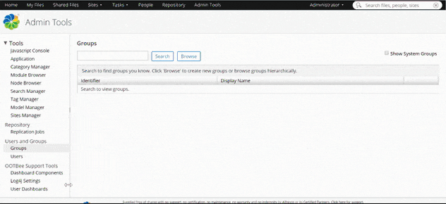
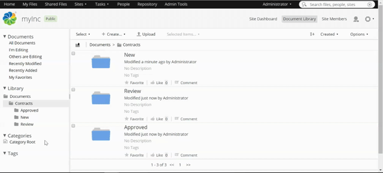

# Order by Permissions

Permissions determine which user can perform what action thereby giving your folder a hierarchy and preventing unwanted changes to your content by unauthorized users.

Over the course of these tutorials you created a site using a Content Model, which enables you to declare any document as a “Contract” and enhance it with the appropriate metadata.

Contracts can then be automatically organized using rules. 

Up to this point any user in your system can enter any folder and change the status of a contract, thereby effectively bypassing all steps to the approval.

Setting up permissions can ensure that only the right users can do certain actions.

 
 

## Prerequisites

This tutorial is a continuation of [Getting started with Content Modeling](contentModel.md) and [Setting up Rules](settingRules.md), so please make sure to complete those before you go on.

 
 

## Understanding permissions in Alfresco Content Services

Permissions are divided into 4 roles a user can assume: Manager, Collaborator, Contributor and Consumer. Permissions can be granted to a named user or to an entire group of users.

Managers have unrestricted access to all content within their folder. That means they can upload files as well as edit and delete other users' content. 

The Collaborator is very similar to the Manager, as he has the same permission set with the exception of deleting content other users uploaded.

The next lower tier is the Contributor, who has free reign over his own content, but can neither edit nor delete other users files.

The Consumer role has no uploading or editing permissions whatsoever, it can only view content other users provide.

These are the default permissions shipped in Alfresco Content Services, but through extending the platform you can build custom roles and permissions based on the lower level Access Control Lists. Extensions like Alfresco Governance Services provide another layer of permissions to your content with security marks and classification. However, for this tutorial we will focus on the basics.

 
 

## Managing users and groups

In order to test the different permissions you need to create a few users and groups. In a production environment these users and groups would most likely be controlled externally in a directory such as Active Directory, LDAP or similar. For now we will create them manually.

Navigate to “Admin Tools” and click “Groups” in the sidebar, then hit “Browse” and find the little “+” in the upper right corner of the list that follows.
Give your group an ID and a name (legal, Legal):

 

 

Now that you have a group let’s fill it with some users, for that just change to “Users” in the side bar and select “New User”. How you name your users doesn’t matter, just make sure to create at least three of them: two in “Legal” and the other one without any group.

Assign a user to a group by typing in the group you need (Legal) in the “Search” field at the bottom and selecting it in the result window.

 

 
 

## Setting up permissions

Once you have created and populated your groups you are at the point where you can actually set up permissions.
 
Go to your “Document Library” and hover over “Contracts” to expand the “More” menu and select “Manage Permissions”.

As it is now, “Share” created groups, which have the same role throughout the whole “Contracts” folder. That doesn’t make much practical sense so deselect “Inherit Permissions” then hit “Add User/ Group” and search for “Everyone” and select it.

Now change the role to “Contributor”.

 

 

Now everybody can upload a new contract, but also just send it through review and approve it themselves.

To prevent that you have to update the permissions for the “New” folder. 
Since “Share” prioritizes inherited permissions over local ones, deselect “Inherit Permissions” and make Legal a Collaborator and demote Everyone to Consumer.

Do the same for the “Review” folder.

Lastly let’s prevent everyone from changing approved contracts by setting the permissions on “Approved” to Everyone: Consumer. 

Let’s check if everything works as it should.

Log in as one of the Legal group members and search for your site under “Sites” in the top bar. Click “Join” on the right then select the site to access it.

 

 

Head to the “Contracts” folder and upload any document you like. Edit some properties to make sure that you actually can change the metadata of your own content then move it to “Review” by changing its status. 

Assuming you completed the last tutorials you should now have one document in every subfolder of “Contracts”. Make sure you can’t edit the one in “Approved” then log out again.

Next log in with the other Legal member, also join your site and hover over the document you just left in “New”. If everything is set up right there should be only one difference to the full menu: you can’t delete this document.
If you want a direct comparison, upload another document with this user.
The same goes for the Contract in the “Review” folder.
Log out again.

Lastly log in with the user without any group and join the site. 

Since everyone is still a Contributor in the “Contracts” folder  you are still able to upload contracts. But editing anything inside the subfolders is now off limits to that user.

If everything works well you are now able to create your own site using simple Content Models and automated processes coordinated by rules.
You can also manufacture rudimentary workflows by setting permissions.

 
 

## Summary

After completing this tutorial you should be able to create and divide users into groups, which in turn can be granted a certain role with a set of permissions entailed.

If you want to know more about permissions, you should have a look at this link:

- [Listing of user roles in greater detail](https://docs.alfresco.com/6.2/references/permissions_share.html)

 
 

## Next Steps

This is the first tutorial in a series of five. Checkout the tutorials below to to continue your journey:  

- [Getting started with Content Modeling](content-model.md)
- [Setting up Rules](setting-up-rules.md)  
- [Smart Folders](smart-folders.md)
- ...
