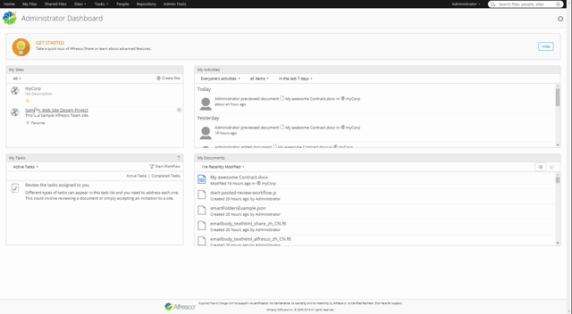
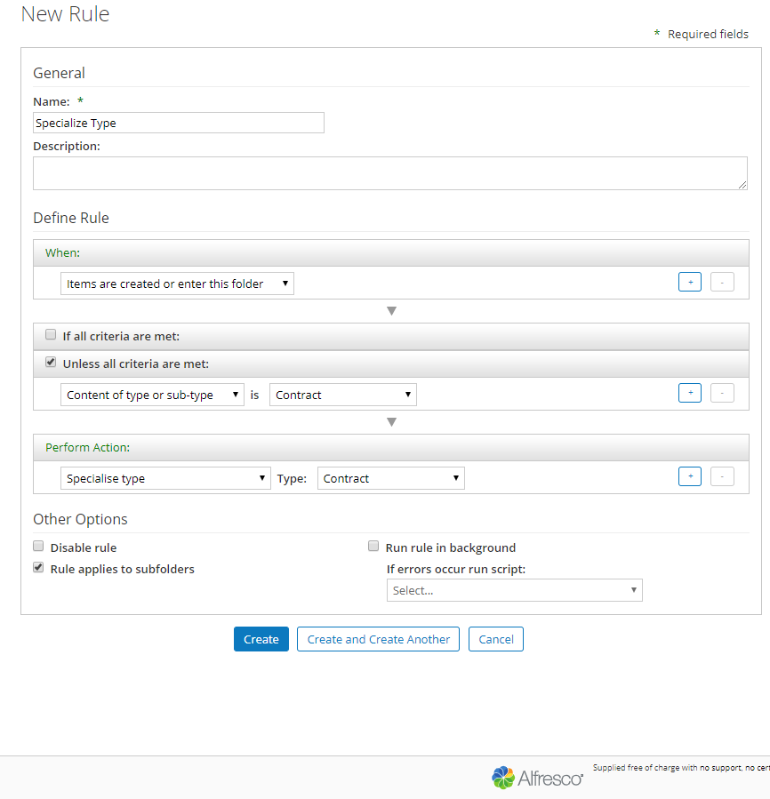
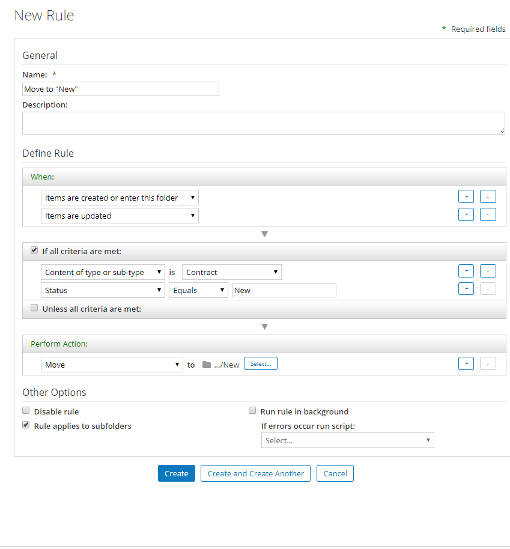
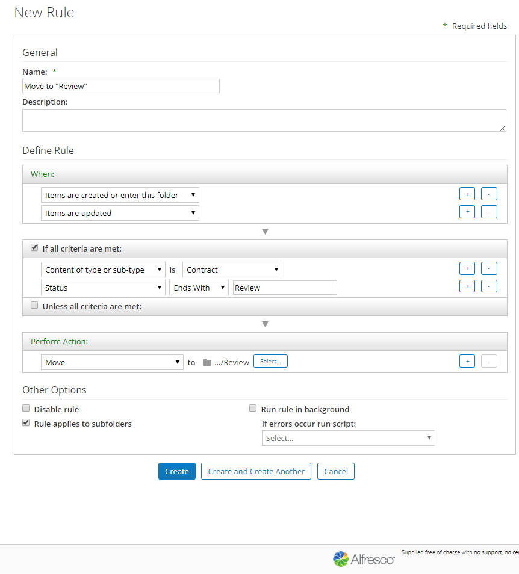
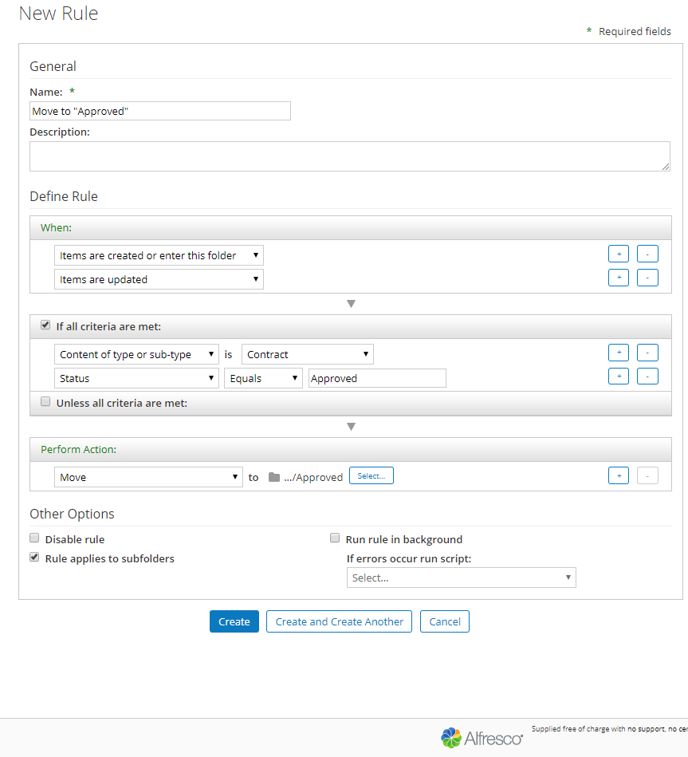
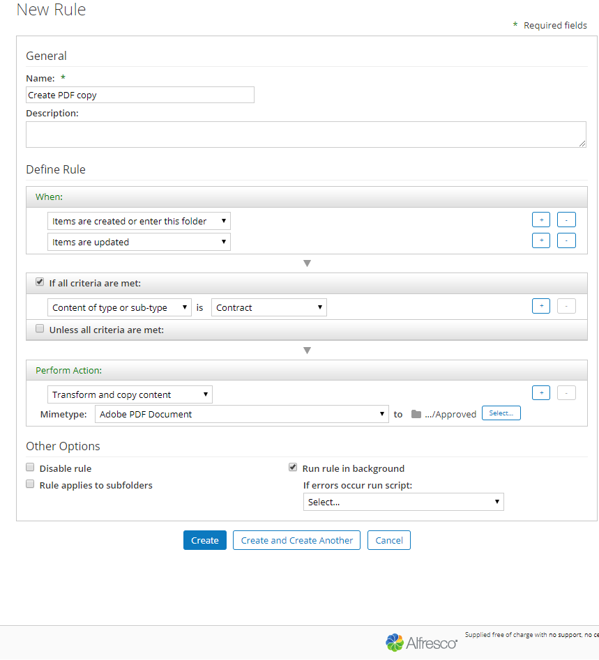

# Setting up Rules

Alfresco Rules and Actions automate a range of content centric actions. This automation removes the need for users to perform repeatable tasks and ensures that tasks are carried out in a timely manner, with consistency and efficiently. Think of Rules and Actions as a “If This That Then” tool for Content Management.  

 
 

## Prerequisites

In order to successfully complete this [tutorial](contentModel.md) you will need to have completed the previous tutorial about Content Modeling in order to have a model for Contracts which will be used for the example rules in this tutorial.

In order to create rules you will need to login into Alfresco Share as this is currently the only application that enables you to create rules. 

 
 

## Understanding rules

A rule consists of one more triggers, conditions and actions.

There are three ways to trigger a rule: By uploading, updating or deleting a file or folder.

Conditions on the other hand are a lot more complex, on the top most level there are “If” and “Unless” conditions.
Rules with an “If”- condition apply to all files, which fulfill that condition, while rules with an “Unless”- condition apply when said condition isn’t matched.
 
A condition can be anything from the contents size over its property to its aspects.

Actions are the core of the rule, they determine what happens with the content that matches all conditions like copying it into another folder, setting a property value, executing a script or custom action. 

Last but not least rules can be applied to subfolders and run either asynchronous or synchronous. Running rules “in the background” means the rule will execute after the content has been uploaded. This is important for operations that could take long or potentially fail - if the rule is running synchronously and fails the content will not be uploaded. 

 
 

## Creating your first rule

In the previous tutorial you created a site containing a “Contracts” folder where you can store your contracts and add specific metadata to them.

As it is now, you would have to do everything manually from declaring a document a “Contract” to moving it from subfolder to subfolder according to its status.

All that can be automated by setting up a few rules.
To do so head to the site you created and open the “Document Library”. Hover over your Contracts folder, expand “More” on the right and click “Manage Rules”. 

 

 

The first one you want to establish is that every document you upload into this folder is automatically declared a “Contract”.
Click “Create Rule” and type in:

 

 

This rule will take every document that isn’t already a “Contract” and turn it into one.
Make sure to tick “Rule applies to subfolders” to ensure that documents directly dropped into one of those are still declared “Contracts”.

 
 

## Automatically organising contracts

Now that all documents that get uploaded into the “Contracts” folder are specialized as Contracts let’s make rules to manage where Contracts are stored according to their status.

We do this by creating three separate rules which apply when a contract is created or updated. The contract is to be moved into the selected folder based on the status property.

These rules are created as follows:

Click “Show more” in the first dropdown menu that is missing in the next Gif:

 

addingStatusCondition <*missing sub menu*>

 

 

 

 

Now every time the status of a contract in any of the subfolders gets updated it is automatically moved to the appropriate folder.
Even newly uploaded contracts get sorted according to their status. 

After the contract has been approved there is no need for it to still be editable, so let’s create a rule that fabricates a pdf copy of it.
Just like that:

 

 

Let’s put your rules to the test.

Upload any document into the “Contracts” and check if it was put into “New” as a Contract. 

If it is stored as a Contract it will have all properties listed on the left side of the screen when you open the document preview.

Now set the Status to “Review” by selecting “Edit Properties” and changing it. Because you declared some properties mandatory you can’t move on without filling them in, thereby ensuring that no Contract enters “Review” without the necessary information.

After you updated the status you can see that the path of your contract, which is displayed over the document's name, has changed.

 

-----------------ruleCheck <*missing sub menu*>---------------------------------

 

Just to make sure, change the Status again to approved this time and check if the path changes again.
Also have a look if there is a pdf copy of your document in your “Approved” folder.

 
 

## Summary

Rules are a great way to automate a lot of content operations specific to your business. Rules can be simple like the ones we’ve just created, or more advanced with custom scripts or Java classes to achieve your goals.

If you’re interested in learning more about rules checkout these resources:

- [Alfresco docs on setting up Rules](https://docs.alfresco.com/6.2/concepts/
  alfresco-tutorial-10.html)  
  
- [Summary of actions a rule can perform](https://docs.alfresco.com/6.2/references/rule-actions.html)  
  
- [Working with a set of rules](https://docs.alfresco.com/6.2/concepts/library-folder-rules-defined.html)  
  
- [Linking to an existing rule set](https://docs.alfresco.com/6.2/tasks/library-folder-rules-define-link.html)

   
   

## Next Steps

Now that you have a rudimentary rule system in place to manage your contracts, you can move on by setting up permissions so only specific users can access certain folders.

This is the second tutorial in a series of five. Checkout the tutorials below to to continue your journey:

- Getting started with Content Modeling  
- Setting up Rules  
- Permissions  
- ..
