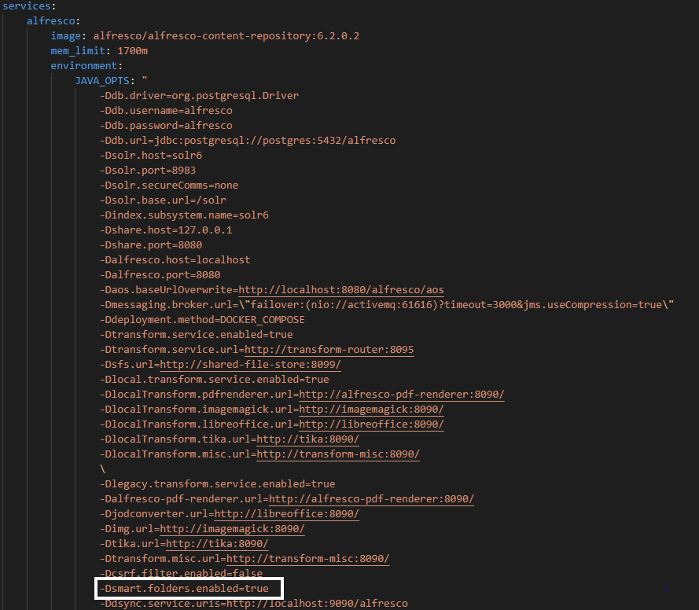
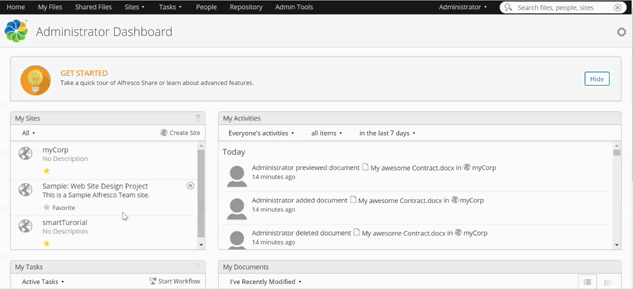
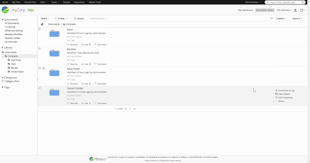

# Smart Folders

Smart Folders are a great tool for intuitively navigating your site. They browse your content by specifications you choose and present them in a structured way for you to examine.

<br />
<br />

## Prerequisites

This tutorial is part of a set of five and requires you to have completed the preceding three, in order to continue:
- [Content Model](contentModel.md)
- [Rules](settingRules.md)
- [Permissions](permissions.md)

<br />
<br />

## How do Smart Folders work

Smart Folders use so-called “Smart Folder Templates” to browse your content for parameters specified within these templates.  
It is worth noting that “Smart Folder” is only another Aspect, albeit an a little more complex one.  
Also you can create multiple Smart Folders within a single template, enabling you to construct an entire structure in your physical folder.
They do not, however, substitute physical folders as they are only a collection of documents gathered from different places in your site and they always need a physical folder to live in.

<br />
<br />

## Enabling Smart Folders

If you downloaded the 30 days trial you need to tell ACS to enable Smart Folders before you can use them.   
Just open the docker-compose file and add the following line:

<br />



<br />
<br />

## Creating your template
Now you will need to create a template to use on your site.  
For that use the editor of your choosing or just download [Visual Studio Code](https://code.visualstudio.com/download). 
You can find the finished template [here](https://github.com/Alfresco/tutorials/blob/master/docs/resources/contract-management/smartFolder.json), but let’s go through it and see what is doing what.

First of all a json file, which is the data type every Smart Folder Template is written in, is only allowed to have one object, that’s why the outer most one only has a name and no ID or query: It only serves as a container and isn’t displayed on your site.  
It doesn’t even need the name, but for the sake of understandability let’s leave it in as a form of headline for your template.  
The next interesting tag is “nodes”, every node will be displayed as a subfolder, thus being the core of your template.  
These nodes use the “search” tag to know what they are looking for. Every “search” tag consists of a “language” and “query” tag. The former specifying how the latter is to be interpreted.  

```
{
    "name" : "Smart Folders",
    "nodes" :[
        {
            "id" : "1",
            "name" : "My Contracts",
            "search":{
                "language": "fts-alfresco",
                "query": "=cm:creator:%CURRENT_USER% AND +TYPE:'ct:contract'"
            },
            
            "nodes" :[
                {
                    "id" : "11",
                    "name" : "Current",
                    "search" :{
                        "language" : "fts-alfresco",
                        "query" : "+ct:draftDate:[NOW/DAY-7DAYS TO TODAY] AND =cm:creator:%CURRENT_USER%"
                    }
                },
            ]
        }, 
```

***Note: The JSON above is only a subset of the full template. [Download the full template here](https://github.com/Alfresco/tutorials/blob/master/docs/resources/contract-management/smartFolder.json)***

The first node of your template gathers every document, the user you are currently logged in as, has ever uploaded and narrows it down to only contracts. It’s worth noting that “ct” is the prefix you gave your content model way back in the first tutorial.

So this subfolder will hold every contract you ever uploaded, no matter its status but what if you only want to see the most recent and probably most relevant ones?  
That’s what the node with the name “Current” is for, it also takes every document created by your current user and filters it for the content of the last week. 
Here you don’t have to specify the custom type, because “draftDate” is a property unique to contract.

The “Overdue” subfolder works in a similar fashion, it takes every contract older than a week and cross references them with the ones that haven’t been approved yet (“-” works as negator).  
Since there is no command to get every date before a certain day you have to use “MIN”, which represents the earliest possible date.

The next nodes are easily summarized as all they do is gather contracts concerning an employee who belongs to a certain department.

Where the first node picked documents by their type, the last one filters them by aspects and only displays those who concern vendors.

<br />
<br />

## Implementing the template
Now that you have an idea of how the template works, let’s implement it into your site.  
For that log into ACS as admin and click “Repository” in the nav bar at the top of the screen, then navigate to “Data Dictionary/Smart Folder Templates” and upload your template.

<br />



<br />

Next create a new folder in the “Contracts” directory within your site and click “Manage Aspects”.  
Add “Custom Smart Folder” from the left bar by clicking the “+” sign, then select “Edit Properties” and “All Properties”.  
Click “Select” under “Smart Folder Template” and again navigate to “Data Dicionary/Smart Folder Templates” and select your template.

<br />



<br />
<br />

## Testing

Let’s see if everything works as it should. Check the folder you just created, within it there should be the following structure.

<br />

```
.
├── Employee_Contracts
│   └── By_Department
│       ├── HR
│       ├── IT
│       ├── Legal
│       └── Sales
├── My_Contracts
│   ├── Current
│   └── Overdue
└── Vendor_Contracts
```
<br />

Depending on what you've already uploaded, some of those folders should already be populated but let’s test the folders with a few specific documents.

First create a vendor contract and set the draftDate to 1/1/2020, then create two employee contracts, set one draftDate to today and the other to the day before yesterday, also choose two different departments.  
Now check the “Current” folder, there should be the two employee contracts in there. Next go and look if the vendor contract is in the “Overdue” folder.
That contract should also be in “Vendor Contracts”.  
Lastly look into the folders for the two departments you chose on your employee contracts and see if you can find them in there.

<br />
<br />

## Summary

With Smart Folders you are now able to navigate your site much quicker. If you want to expand on the already existing structure or learn more you should check out these links:

- [Video Tutorials](https://docs.alfresco.com/6.2/topics/smart-video-tutorials.html)
- [Configuring Smart Folders](https://docs.alfresco.com/6.2/concepts/sf-intro.html)
- [Template syntax](https://docs.alfresco.com/6.2/concepts/sf-ref-template-guidance.html)
- [AFT Search Commands](https://docs.alfresco.com/search-enterprise/concepts/searchsyntax-intro.html)
- [Alfresco UIniversity course on Smart Folders](https://university.alfresco.com/acs-share-smart-folders)
- [FAQs](https://docs.alfresco.com/6.2/references/sf-tech-faqs.html)

<br />

By the way, if you want to expand on the template you created in this tutorial you can update it in ACS by selecting it in “Repository/Data Dictionary/Smart Folder Templates” and clicking “Upload New Version”.

<br />
<br />

## Next Steps

Your test site is almost done now: It uses a Content Model to categorize your documents as contracts and automatically organizes them using rules.  
Also you established a hierarchy by setting up groups and assigning them different sets of permissions and you gave your site an easy way to access content from anywhere on it with Smart Folders.

The last thing that’s missing is creating a basic ADF Application.

- [Getting started with Content Modeling](content-model.md)
- [Setting up Rules](setting-up-rules.md)
- [Permissions](setting-up-permissions.md)
- [Connect to Application](connect-to-app.md)
